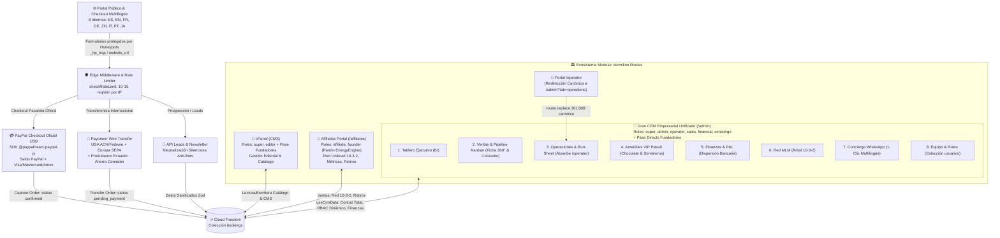
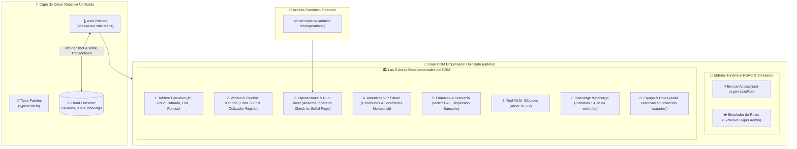
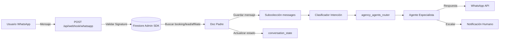

# 🗺️ VERMILION ROUTES — PLANO MAESTRO ARQUITECTÓNICO (ARCHITECTURE MAP)

> **Documento:** `ARCHITECTURE_MAP.md`  
> **Versión:** `1.21.0`  
> **Última Actualización:** 2026-09-22  
> **Responsable:** Arquitecto de Sistemas de Vermilion Routes  
> **Estado:** Activo / Vigente  

---

## 1. Visión General del Ecosistema

El ecosistema **Vermilion Routes** es una plataforma integral de turismo de lujo boutique para Ecuador y las Islas Galápagos. Integra una interfaz pública de alto rendimiento (Next.js App Router, SSR/CSR, diseño editorial premium, pasarelas de pago de ultra-lujo y soporte para 8 idiomas) con módulos operativos consolidados y respaldados por Google Cloud / Firebase Firestore:



### Los Módulos del Sistema

| Módulo | Nombre Operativo | Propósito Principal | Roles Permitidos | Directorio / Archivos Clave |
| :--- | :--- | :--- | :--- | :--- |
| **Módulo 1** | **cPanel (CMS)** | Gestión de contenidos estáticos y dinámicos: catálogo de Tours, Itinerarios día a día, Hero Slider de bienvenida, Destinos, Artículos de Blog, Preguntas Frecuentes (FAQs), testimonios y enlaces de Footer. Blindado con pase directo maestro para cuentas fundadoras y mensajes de error 403 confidenciales. | `super`, `editor` *(y Pase Directo Fundadores)* | [`app/[locale]/cpanel/page.tsx`](./app/[locale]/cpanel/page.tsx)<br>[`components/admin/AdminLoginForm.tsx`](./components/admin/AdminLoginForm.tsx) (Validación en `usuarios` + Bypass Fundadores) |
| **Módulo 2** | **Admin (Gran CRM Empresarial Unificado)** | Centro de comando maestro y torre de control de las 8 áreas operativas de la compañía (BI, Ventas, Operaciones, Pakari, Finanzas, Red MLM, WhatsApp Concierge y Directorio de Personal). Incorpora Sidebar Dinámico RBAC, simulador de roles para Super Admin, pase directo garantizado para fundadores y pantalla 403 sin filtración de roles. | `super`, `admin`, `operator`, `sales`, `financial`, `concierge`, `editor` *(y Pase Directo Fundadores)* | [`app/[locale]/admin/layout.tsx`](./app/[locale]/admin/layout.tsx) (Layout Guard Corporativo 403 Confidencial)<br>[`app/[locale]/admin/page.tsx`](./app/[locale]/admin/page.tsx)<br>[`components/crm/AdminCrmDashboard.tsx`](./components/crm/AdminCrmDashboard.tsx) |
| **Módulo 3** | **Operator (Redirección Canónica & Alias de Campo)** | Punto de entrada unificado para guías naturalistas y operadores de campo: redirige de forma canónica hacia la pestaña *Operaciones & Run-Sheet* del Gran CRM Empresarial (`/[locale]/admin?tab=operations`), preservando compatibilidad y control de acceso. | `super`, `admin`, `operator` | [`app/[locale]/operator/layout.tsx`](./app/[locale]/operator/layout.tsx) (Layout Guard 403 Forbidden)<br>[`app/[locale]/operator/page.tsx`](./app/[locale]/operator/page.tsx) (`router.replace` canónico) |
| **Módulo 4** | **Affiliates (Portal de Embajadores)** | Plataforma de afiliados y embajadores de ventas de ultra-lujo: registro con código de referido único, árbol genealógico unilevel ("10-3-2"), métricas de volumen personal (VP) y grupal (VG), materiales de marketing, liquidación de ganancias y solicitud de retiros bancarios. Protegido bajo el patrón arquitectónico EnergyEngine: asunción de rol `affiliate` por defecto en documentos de la colección, telemetría diagnóstica en consola ('chismosos'), retención en el formulario ante error y confidencialidad bancaria estricta en avisos 403. | `affiliate`, `founder` *(y Super Admin auditoría)* | [`app/[locale]/affiliates/layout.tsx`](./app/[locale]/affiliates/layout.tsx) (Guard EnergyEngine & Status)<br>[`app/[locale]/auth/affiliates/page.tsx`](./app/[locale]/auth/affiliates/page.tsx) (Alertas 403 Confidenciales) |

---

## 2. Matriz de Roles y Permisos (RBAC)

El sistema opera bajo un modelo estricto de control de acceso basado en roles (Role-Based Access Control) con tipado exhaustivo en `UserRole`. Los roles están clasificados en dos niveles de almacenamiento:
1. **Personal Corporativo y Departamental:** Almacenados en la colección [`usuarios`](#31-colección-usuarios) (autenticación vía Firebase Auth + perfil en Firestore; tipado en [`SystemUser`](./types/crm.ts#L11-L26)).
2. **Embajadores de Red Comercial:** Almacenados en la colección [`affiliates`](#32-colección-affiliates) (autenticación por username/email con sesión protegida mediante el patrón Energyengine y modal blindado para cambio forzado de contraseña en primer ingreso).

### 2.1 Definición de Roles

* **`super` (Super Administrador):** Máximo nivel de autoridad institucional y técnica. Posee acceso y visibilidad irrestricta sobre las **8 áreas completas de la empresa**, cPanel (CMS), bases de datos, finanzas maestras y autorización de desembolsos. Cuenta en exclusiva con el **Selector de Simulación de Roles** (`activeRoleView`) para auditar la experiencia visual de cualquier colaborador en tiempo real.
* **`admin` (Administrador Operativo / CRM General):** Co-administrador general de la compañía. Posee acceso y visibilidad integral sobre las **8 áreas departamentales del CRM**, supervisión de bookings, avance del pipeline comercial, reasignación de guías y revisión preliminar de pagos.
* **`operator` (Operador Logístico / Guía de Campo):** Especialista en la ejecución en ruta. Su acceso en el CRM está restringido exclusivamente a **Operaciones & Run-Sheet** (itinerario día a día, choferes, hoteles, check-in de actividades y botón *Señalar Viaje Realizado*) y **Amenities VIP Pakari** (confirmación de entrega de chocolate y sombreros a bordo).
* **`sales` (Comercial / Travel Designer):** Especialista en conversión y diseño de itinerarios a medida. Su acceso está restringido exclusivamente a **Ventas & Pipeline Kanban** (Ficha 360° del Pasajero y Cotizador Rápido VIP) y **Concierge WhatsApp** (plantillas de prospección y seguimiento en 1 clic).
* **`financial` (Finanzas & Tesorería):** Especialista contable y fiduciario. Su acceso está restringido exclusivamente a **Finanzas & Liquidaciones** (Matriz P&L por expedición, dispersión de pagos bancarios a Banco Pichincha/Produbanco/Zelle/SWIFT y registro de comprobantes).
* **`concierge` (Concierge & Atención a Huéspedes):** Especialista en experiencia de ultra-lujo y amenidades. Su acceso está restringido exclusivamente a **Amenities VIP Pakari** (supervisión y asignación de kits) y **Concierge WhatsApp** (comunicación multilingüe de bienvenida y soporte).
* **`editor` (Editor de Contenidos / CMS):** Responsable de crear, actualizar y publicar tours, itinerarios, entradas de blog, banners y textos de landing pages en **cPanel** sin acceso a datos financieros o CRM confidencial de clientes.
* **`affiliate` (Embajador de Marca / Afiliado):** Agente comercial independiente que promueve tours mediante enlaces de tracking y percibe comisiones según el plan de compensación unilevel 10-3-2 en el portal de embajadores.

### 2.2 Matriz de Accesos por Módulo y Capacidad (Sidebar Dinámico RBAC)

La navegación del Gran CRM Empresarial en `/admin` se adapta dinámicamente según el rol autenticado o simulado (`canAccess(tab)`):

| Módulo / Recurso / Área | `super` | `admin` | `operator` | `sales` | `financial` | `concierge` | `editor` | `affiliate` |
| :--- | :---: | :---: | :---: | :---: | :---: | :---: | :---: | :---: |
| **1. Tablero Ejecutivo (BI & GMV)** | ✅ Total | ✅ Total | ❌ | ❌ | ❌ | ❌ | ❌ | ❌ |
| **2. Ventas & Pipeline Kanban (Cotizador & Ficha 360°)** | ✅ Total | ✅ Total | ❌ | ✅ Total | ❌ | ❌ | ❌ | ❌ |
| **3. Operaciones & Run-Sheet (Check-in & Señal Pago)** | ✅ Total | ✅ Total | ✅ Asignados | ❌ | ❌ | ❌ | ❌ | ❌ |
| **4. Amenities VIP Pakari (Entrega a Bordo)** | ✅ Total | ✅ Total | ✅ Verificar | ❌ | ❌ | ✅ Total | ❌ | ❌ |
| **5. Finanzas & Tesorería (Matriz P&L & Dispersión)** | ✅ Liquidar | ✅ Auditar | ❌ | ❌ | ✅ Dispersar | ❌ | ❌ | ❌ |
| **6. Red MLM  Globales (Árbol 10-3-2)** | ✅ Total | ✅ Total | ❌ | ❌ | ❌ | ❌ | ❌ | ❌ |
| **7. Concierge WhatsApp (Plantillas 1-Clic)** | ✅ Total | ✅ Total | ❌ | ✅ Total | ❌ | ✅ Total | ❌ | ❌ |
| **8. Equipo & Roles (Colección `usuarios`)** | ✅ Total | ✅ Total | ❌ | ❌ | ❌ | ❌ | ❌ | ❌ |
| **Selector de Simulación de Roles (`activeRoleView`)** | ✅ Exclusivo | ❌ | ❌ | ❌ | ❌ | ❌ | ❌ | ❌ |
| **Acceso a Módulo cPanel (CMS)** | ✅ Total | ❌ | ❌ | ❌ | ❌ | ❌ | ✅ Total | ❌ |
| **Acceso a Portal de Embajadores (/affiliates)** | ✅ Auditoría | ✅ Auditoría | ❌ | ❌ | ❌ | ❌ | ❌ | ✅ Exclusivo |

### 2.3 Arquitectura de Layout Guards y Blindaje Anti-Adulteración (RBAC)

Para garantizar que ningún usuario acceda a paneles operativos sin autorización o mediante manipulación manual de URLs/tokens, la plataforma implementa una estrategia de defensa en profundidad basada en **Layout Guards reactivos** en el App Router de Next.js (`layout.tsx`), validación de colecciones de Firestore, pase directo para fundadores y alertas de seguridad 403 bajo estándares de confidencialidad bancaria:

```mermaid
flowchart TD
    Req([Navegación del Usuario]) --> CheckModule{Ruta Destino}
    
    CheckModule -->|/affiliates/*| AffGuard["Affiliates Layout Guard (EnergyEngine Pattern)\n(app/[locale]/affiliates/layout.tsx)"]
    CheckModule -->|/admin/*| AdminGuard["Admin Layout Guard Corporativo\n(app/[locale]/admin/layout.tsx)"]
    CheckModule -->|/operator/*| OpGuard["Operator Layout Guard & Redirect\n(app/[locale]/operator/page.tsx)"]
    CheckModule -->|/cpanel/*| CPanelGuard["cPanel Page & Login Guard\n(app/[locale]/cpanel/page.tsx)"]
    
    %% Affiliates Guard Flow
    AffGuard --> AuthStateAff{¿Sesión en Firebase Auth?}
    AuthStateAff -->|No| RedirectAffAuth["Redirige a /auth/affiliates"]
    AuthStateAff -->|Sí| MasterCheckAff{¿Es Fundador Maestro o Super Admin?}
    MasterCheckAff -->|Sí (pablofgarciaf, info@, super)| PassAff[Acceso Concedido (Auditoría Técnica)]
    MasterCheckAff -->|No| DocAffCheck{¿Existe en 'affiliates'?}
    DocAffCheck -->|No| ExpelAffNotFound["signOut(auth) + Redirige a Formulario:\n/auth/affiliates?error=not_found"]
    DocAffCheck -->|Sí (EnergyEngine: default 'affiliate')| RoleAffCheck{¿role == 'affiliate' | 'founder'?}
    RoleAffCheck -->|Adulterado / Inválido| ExpelAffRole["signOut(auth) + Redirige a Formulario:\n/auth/affiliates?error=invalid_role"]
    RoleAffCheck -->|Válido| StatusAffCheck{¿status == 'suspended' | 'blocked' | 'inactive'?}
    StatusAffCheck -->|Suspendido / Inactivo| ExpelAffStatus["signOut(auth) + Redirige a Formulario:\n/auth/affiliates?error=suspended"]
    StatusAffCheck -->|Activo| ForcePwdCheckAff{¿forcePasswordChange == true?}
    ForcePwdCheckAff -->|Sí| RedirectAffPwd["Redirige a /auth/affiliates (Modal Cambio Clave)"]
    ForcePwdCheckAff -->|No| PassAff
    
    %% Admin Guard Flow (Multi-Role Corporate + Master Pass)
    AdminGuard --> AuthStateAdmin{¿Sesión en Firebase Auth?}
    AuthStateAdmin -->|No| DeniedAdmin["403 Forbidden\n(Pantalla Acceso Restringido Confidencial)"]
    AuthStateAdmin -->|Sí| MasterCheckAdmin{¿Es Correo Fundador Maestro?\npablofgarciaf@, info@, admin@}
    MasterCheckAdmin -->|Sí (Pase Directo Fundador)| PassAdminMaster["Acceso Concedido Inmediato\n(Rol 'super' garantizado sin depender de 'usuarios')"]
    MasterCheckAdmin -->|No| UserDocAdmin{¿Existe en 'usuarios'?}
    UserDocAdmin -->|No| DeniedAdmin
    UserDocAdmin -->|Sí| RoleCheckAdmin{¿Es Personal Corporativo?\nsuper, admin, operator, sales, financial, concierge, editor}
    RoleCheckAdmin -->|Sí| PassAdmin["Acceso Concedido al Gran CRM\n(Sidebar filtrado por canAccess(tab))"]
    RoleCheckAdmin -->|No (ej. affiliate o externo)| DeniedAdmin
    
    %% Operator Guard Flow & Canonical Redirect
    OpGuard --> AuthStateOp{¿Sesión en Firebase Auth?}
    AuthStateOp -->|No| DeniedOp["403 Forbidden\n(Pantalla Acceso Operativo Restringido)"]
    AuthStateOp -->|Sí| UserDocOp{¿Existe en 'usuarios'?}
    UserDocOp -->|No| DeniedOp
    UserDocOp -->|Sí| RoleCheckOp{¿role == 'super' | 'admin' | 'operator'?}
    RoleCheckOp -->|Sí| RedirectToAdminOps["Redirección Canónica Inmediata:\nrouter.replace(/[locale]/admin?tab=operations)"]
    RoleCheckOp -->|No| DeniedOp
    
    %% cPanel Guard Flow (+ Master Founder Pass)
    CPanelGuard --> AuthStateCPanel{¿Sesión en Firebase Auth?}
    AuthStateCPanel -->|No| ShowLoginForm["Despliega AdminLoginForm"]
    AuthStateCPanel -->|Sí| MasterCheckCPanel{¿Es Correo Fundador Maestro?\npablofgarciaf@, info@, admin@}
    MasterCheckCPanel -->|Sí (Pase Directo Fundador)| PassCPanel[Acceso Concedido al CMS (Super Admin)]
    MasterCheckCPanel -->|No| UserDocCPanel{¿Existe en 'usuarios'?}
    UserDocCPanel -->|No| BlockCPanel["signOut(auth) + Error 403 Confidencial en Form"]
    UserDocCPanel -->|Sí| RoleCheckCPanel{¿role == 'super' | 'editor'?}
    RoleCheckCPanel -->|Sí| PassCPanel
    RoleCheckCPanel -->|No (ej. operator, affiliate)| BlockCPanel
```

#### 1. Blindaje en `app/[locale]/affiliates/layout.tsx` (Patrón EnergyEngine, Telemetría & Lifecycle Check)
* **Archivo:** [`app/[locale]/affiliates/layout.tsx`](./app/[locale]/affiliates/layout.tsx)
* **Adopción del Patrón EnergyEngine (Rol por Defecto):** Consulta reactiva mediante [`getAffiliateByEmail`](./lib/affiliates.ts). Si el registro existe en la colección `affiliates`, el sistema asume `rawRole = String(aff.role || 'affiliate').toLowerCase().trim()`. Si el campo `role` no fue especificado en Firestore (típico en cuentas históricas o migradas como `ing.pablo`), se asume automáticamente `'affiliate'`, resolviendo el acceso fluido de los embajadores.
* **Telemetría y Diagnóstico en Tiempo Real ('Chismosos'):** Emite trazas pormenorizadas en consola (`🕵️‍♂️ [CHISMOSO AFFILIATES LAYOUT]`) auditando: (1) Sesión activa en Firebase Auth, (2) Documento Firestore encontrado, (3) Rol verificado y autorización, (4) Estatus de cuenta, (5) Validación de primer cambio obligatorio de clave.
* **Manejo de Errores con Retención en Formulario (Sin Expulsiones Inesperadas):** Si una cuenta no está autorizada, está suspendida o no existe, el guard purga el token de memoria con `await signOut(auth)`, detiene el loader y redirige al usuario hacia la página de autenticación:
  ```
  /${locale}/auth/affiliates?error=[invalid_role | suspended | not_found]
  ```
  El usuario **permanece siempre en el formulario** de `/auth/affiliates` para examinar el mensaje de error, corregir sus credenciales o reintentar, erradicando cualquier expulsión intempestiva hacia la página de inicio (`/`).
* **Confidencialidad Bancaria Total en Alertas 403:** En estricto apego a estándares de seguridad corporativa y fiduciaria, los mensajes de error en pantalla y formularios no revelan nombres internos de roles técnicos (`affiliat`, `super`, `editor`, etc.), protegiendo el diseño interno del sistema frente a ojos de terceros.
* **Excepción de Auditoría Técnica para Super Admin y Fundadores:** Si la cuenta autenticada figura en `usuarios` con `role === 'super'` o pertenece a un fundador maestro, se le otorga bypass de visualización para soporte técnico y auditoría sin requerir registro en `affiliates`.
* **Excepciones Públicas Permitidas:** Rutas exentas de guard: `/${locale}/affiliates/presentation`, `/${locale}/affiliates/verify` y `/${locale}/presentation`.

#### 2. Layout Guard Corporativo en `app/[locale]/admin/layout.tsx` (Error 403 Forbidden & Pase Fundadores)
* **Archivo:** [`app/[locale]/admin/layout.tsx`](./app/[locale]/admin/layout.tsx)
* **Propósito:** Blindar el Módulo 2 (Gran CRM Empresarial Unificado).
* **Blindaje de Admin para Fundadores (Pase Directo Maestro):**
  Antes de consultar la colección `usuarios`, el guard evalúa si el correo electrónico corresponde a la lista de fundadores y administradores maestros:
  ```typescript
  const isMaster =
    cleanEmail === 'pablofgarciaf@gmail.com' ||
    cleanEmail === 'info@vermilionroutes.com' ||
    cleanEmail === (process.env.NEXT_PUBLIC_ADMIN_EMAIL || 'admin@vermilionroutes.com').toLowerCase().trim();
  ```
  De coincidir, concede acceso directo e inmediato con `userRole = 'super'`, **garantizando operatividad ininterrumpida incluso si la colección `usuarios` está en construcción, vacía o en migración**.
* **Control de Acceso Multirrol Corporativo:**
  * Lee el token de sesión con `onAuthStateChanged(auth)`.
  * Consulta el documento en `/usuarios/{cleanEmail}`.
  * Valida la pertenencia a los roles corporativos autorizados:
    ```typescript
    const allowedInternalRoles = ['super', 'admin', 'operator', 'sales', 'financial', 'concierge', 'editor'];
    ```
* **Telemetría y Diagnóstico ('Chismosos'):** Logs exhaustivos en consola (`🕵️‍♂️ [CHISMOSO ADMIN LAYOUT]`) para registrar el tipo de usuario (Fundador, Personal Interno o Acceso Denegado).
* **Respuesta ante Acceso No Autorizado (403 Forbidden Confidencial):**
  * Para usuarios sin sesión o cuentas externas ajenas al personal (`affiliate` o usuarios no registrados), el layout **no monta ni expone el Gran CRM**.
  * Renderiza directamente una pantalla de seguridad `403 Forbidden · Acceso Restringido` estilizada.
  * **Confidencialidad Bancaria:** Se eliminó cualquier visualización del rol del usuario (`Tu rol actual: [rol]`) en pantalla. La interfaz presenta únicamente la advertencia neutral:
    > *"Este módulo empresarial está reservado exclusivamente para personal corporativo autorizado."*
    Acompañada de botones para cerrar sesión (`signOut(auth)`) o retornar al portal principal.

#### 3. Redirección Canónica & Layout Guard en `app/[locale]/operator/`
* **Archivos:** [`app/[locale]/operator/layout.tsx`](./app/[locale]/operator/layout.tsx) y [`app/[locale]/operator/page.tsx`](./app/[locale]/operator/page.tsx)
* **Unificación Arquitectónica:** Con la consolidación del Gran CRM, el módulo de operaciones se ha integrado nativamente en `/admin?tab=operations`. La ruta `/operator` opera como alias canónico permanente.
* **Redirección Canónica Inmediata:** [`app/[locale]/operator/page.tsx`](./app/[locale]/operator/page.tsx) despacha en el ciclo de montaje:
  ```typescript
  useEffect(() => {
    router.replace(`/${locale}/admin?tab=operations`);
  }, [router, locale]);
  ```
  Mostrando un spinner dorado boutique con la leyenda *"Conectando con el Centro de Mando Vermilion..."*.
* **Layout Guard de Respaldo:** [`app/[locale]/operator/layout.tsx`](./app/[locale]/operator/layout.tsx) protege la ruta requiriendo que la cuenta pertenezca a `usuarios` con roles `super`, `admin` u `operator`, expulsando a cualquier otro usuario con pantalla 403 Forbidden en acentos teal.

#### 4. Selector de Simulación de Roles Exclusivo para Super Admin (`activeRoleView`)
* **Archivo:** [`components/crm/AdminCrmDashboard.tsx`](./components/crm/AdminCrmDashboard.tsx)
* **Propósito:** Permitir al Super Administrador (`userRole === 'super'`) cambiar instantáneamente su perspectiva de rol visual mediante el selector reactivo `activeRoleView`.
* **Capacidades del Simulador:**
  * **Super Admin:** Muestra las 8 áreas completas sin restricciones.
  * **Admin Operativo:** Simula la supervisión general de la empresa.
  * **Operador / Guía:** Oculta 6 áreas y revela únicamente *Operaciones & Run-Sheet* y *Amenities VIP Pakari*.
  * **Comercial / Ventas:** Restringe la interfaz únicamente a *Ventas & Pipeline Kanban* y *WhatsApp Concierge*.
  * **Finanzas:** Muestra exclusivamente *Finanzas & Tesorería (Matriz P&L y dispersión bancaria)*.
  * **Concierge:** Enfoque exclusivo en *Amenities VIP Pakari* y *WhatsApp Concierge*.
* **Seguridad de la Simulación:** No adultera los permisos de base de datos ni los tokens de sesión en Firebase; es un mecanismo de introspección reactiva en la capa UI para auditoría y verificación de experiencia de usuario (UX/RBAC).

#### 5. Control de Acceso Estricto en `app/[locale]/cpanel/page.tsx` y `AdminLoginForm.tsx` (Pase Fundadores & 403 Confidencial)
* **Archivos:** [`app/[locale]/cpanel/page.tsx`](./app/[locale]/cpanel/page.tsx) y [`components/admin/AdminLoginForm.tsx`](./components/admin/AdminLoginForm.tsx)
* **Propósito:** Blindar el Módulo 1 (CMS Editorial y Catálogo de Tours).
* **Blindaje de cPanel para Fundadores (Pase Directo Maestro):**
  Tanto en la página (`cpanel/page.tsx`) como en el formulario de inicio de sesión (`AdminLoginForm.tsx`), las cuentas maestras fundadoras (`pablofgarciaf@gmail.com`, `info@vermilionroutes.com`, `admin@vermilionroutes.com`) disponen de validación prioritaria automática:
  ```typescript
  const isMaster =
    cleanEmail === 'pablofgarciaf@gmail.com' ||
    cleanEmail === 'info@vermilionroutes.com' ||
    cleanEmail === (process.env.NEXT_PUBLIC_ADMIN_EMAIL || 'admin@vermilionroutes.com').toLowerCase().trim();
  ```
  Si el correo coincide, se aprueba el acceso como Super Admin sin depender de que exista el registro en la colección `usuarios`.
* **Control de Acceso en Formulario (`AdminLoginForm`):** Para otros colaboradores, tras autenticar en Firebase Auth, consulta el documento en `usuarios`. Si la cuenta no posee rol `'super'` ni `'editor'`, purga la sesión con `signOut(auth)`.
* **Confidencialidad Bancaria Total en Error 403:** Se eliminó la antigua divulgación de roles en pantalla (`Tu rol "[rol]" no tiene permisos...`). En su lugar, el sistema despliega un mensaje corporativo estricto:
  > *"Acceso denegado (403): Tu cuenta no dispone de permisos para acceder a cPanel."*
* **Logs Diagnósticos ('Chismosos'):** Emite trazas en consola (`🕵️‍♂️ [CHISMOSO CPANEL]`, `🕵️‍♂️ [CHISMOSO ADMIN LOGIN]`) para auditar la resolución de credenciales.

#### 6. Manejo de Alertas de Seguridad (403) en `app/[locale]/auth/affiliates/page.tsx` (Patrón EnergyEngine)
* **Archivo:** [`app/[locale]/auth/affiliates/page.tsx`](./app/[locale]/auth/affiliates/page.tsx)
* **Captura de Códigos de Error por URL (Banners Confidenciales):** El componente captura el search param `?error=` inyectado por los layout guards y renderiza cajas de advertencia sin divulgar nombres de roles internos:
  * `error=invalid_role`: Despliega banner rojo de alta visibilidad:
    > **ACCESO DENEGADO (403):** Tu cuenta no dispone de permisos para ingresar a este portal.
  * `error=suspended`: Despliega banner rojo de advertencia:
    > **CUENTA SUSPENDIDA:** Tu cuenta de embajador se encuentra temporalmente inactiva. Contacta a soporte.
  * `error=not_found`: Despliega banner rojo:
    > **CUENTA NO ENCONTRADA:** No existe registro de embajador para este usuario.
* **Patrón EnergyEngine en Login y Sesión:**
  * Al evaluar el documento en Firestore (`getAffiliateByEmail` o `getAffiliateByUsername`), adopta el valor por defecto: `rawRole = String(aff.role || 'affiliate').toLowerCase().trim()`.
  * Estatus por defecto: `status = String(aff.status || 'active').toLowerCase().trim()`.
  * Si el rol o estatus no son válidos, el usuario **permanece en el formulario** con el mensaje de error correspondiente (`setErrorMsg`), permitiendo la corrección inmediata de credenciales sin ser redirigido a la raíz ni expulsado del flujo.
  * Telemetría en consola mediante logs 'chismosos': `🕵️‍♂️ [CHISMOSO AUTH FORM]` y `🕵️‍♂️ [CHISMOSO LOGIN FORM]`.

---

### 2.4 Infraestructura en el Edge y Middleware (`proxy.ts`)

El archivo [`proxy.ts`](./proxy.ts) actúa como el interceptor de infraestructura en el Edge para la aplicación, coordinando rate limiting, autorizaciones serverless y enrutamiento internacional.

> **⚠️ Acción Pendiente:** El middleware `proxy.ts` actualmente configura solo 3 locales (`en`, `es`, `it`) en `next-intl`. Requiere actualización para soportar los 8 idiomas oficiales declarados: `es`, `en`, `fr`, `de`, `zh`, `it`, `pt`, `ja`.

> **⚠️ Acción Pendiente:** El middleware `proxy.ts` actualmente configura solo 3 locales (`en`, `es`, `it`) en `next-intl`. Requiere actualización para soportar los 8 idiomas oficiales declarados: `es`, `en`, `fr`, `de`, `zh`, `it`, `pt`, `ja`.

#### 1. Eliminación de la Regla de Redirección Legacy en Producción
* **Problema Arquitectónico Previo:** El middleware contenía una regla histórica en el paso inicial que evaluaba si la ruta solicitada incluía `/dashboard` o `/network`. Si el encabezado `Host` no correspondía a `embassy.vermilionroutes.com` ni a `localhost`, despachaba inmediatamente una redirección hacia la raíz (`/`). En consecuencia, cuando los embajadores navegaban en el dominio principal de producción (`vermilionroutes.com/es/affiliates/dashboard`), eran expulsados a la página de inicio en lugar de acceder a su panel de control.
* **Resolución y Estado Actual:** La regla legacy fue **completamente eliminada** de [`proxy.ts`](./proxy.ts). Las rutas canónicas `/affiliates/dashboard` y `/affiliates/network` fluyen de forma transparente hacia el App Router de Next.js y los Layout Guards en todos los dominios autorizados (`vermilionroutes.com`, `embassy.vermilionroutes.com` y entornos de desarrollo).

#### 2. Responsabilidades Activas en el Edge
1. **Rate Limiting Defensivo por IP (`checkRateLimit`):**
   * `/api/concierge/*`: 15 solicitudes / minuto (defensa contra saturación de inferencia LLM e invocaciones a OpenAI/NVIDIA).
   * `/api/checkout/*`: 10 solicitudes / minuto (mitigación de ataques de card testing, generación fraudulenta de órdenes en PayPal y sesiones en Stripe).
   * `/api/leads/*`: 10 solicitudes / minuto (protección contra spam de formularios y saturación de webhooks en n8n/Firestore).
2. **Autorización Segura para `/api/seed`:** Validación estricta mediante Bearer Token (`process.env.SEED_SECRET`) o cookie de sesión `__session`, retornando HTTP 401 Unauthorized ante peticiones no autorizadas.
3. **Internacionalización y Negociación de Idioma (`next-intl`):** Enrutamiento con prefijo de idioma obligatorio (`localePrefix: 'always'`) soportando 8 idiomas oficiales: `es`, `en`, `fr`, `de`, `zh`, `it`, `pt`, `ja`. La negociación automática via `Accept-Language` en el Edge middleware (`proxy.ts`) enruta al idioma nativo del visitante.

---

### 2.5 Módulo de Seguridad Perimetral, Sanitización y Blindaje Anti-Bots / Scripts Python

Con el objetivo de neutralizar scrapers automatizados, ataques de fuerza bruta, bots de Python (`requests`, `urllib`, `aiohttp`, `scrapy`, Selenium, Playwright) y recolectores automáticos de formularios sin penalizar la experiencia del viajero distinguido ni contaminar Cloud Firestore, el sistema implementa una arquitectura defensiva multicapa:

```mermaid
flowchart TD
    Req([Petición Externa HTTP / Form Submit]) --> RateLimit{Edge Rate Limiter\n(proxy.ts Sliding Window)}
    RateLimit -->|Excede cuota IP (10-15 req/min)| Reject429["429 Too Many Requests\n(Cabeceras Retry-After / X-RateLimit-*)"]
    RateLimit -->|Permitido| HOF[withValidation HOF\n(lib/apiHandler.ts)]
    
    HOF --> ParseJSON{¿JSON Válido?}
    ParseJSON -->|Malformado| Err400["400 Bad Request\n'JSON payload inválido'"]
    ParseJSON -->|Correcto| HoneypotCheck{¿Campo Honeypot activo?\n_hp_trap != '' || website_url != ''}
    
    HoneypotCheck -->|Sí (Script Bot detectado)| TrapCatch["🛡️ Silent Trap Catch:\n1. Log advertencia en servidor\n2. CERO escrituras en Firestore\n3. CERO correos SMTP emitidos\n4. Retorna HTTP 200 { success: true } simulado"]
    HoneypotCheck -->|No (Usuario Legítimo)| ZodValidation{Validación de Esquema Zod\n(leadSchema / payoneerTransferSchema)}
    
    ZodValidation -->|Campos Inválidos| ErrZod["400 Bad Request\n(Detalle Zod formateado)"]
    ZodValidation -->|Válido| Sanitize[Sanitización Allowlist sanitizeText\nStrip HTML, on*, pseudo-protocolos, RFC 5322]
    Sanitize --> FirestoreSave[(🔥 Cloud Firestore Persistencia Limpia)]
```

#### 1. Trampas Honeypot Silenciosas (`_hp_trap` y `website_url`)
* **Archivos Clave en Backend:**
  - Lead Ingestion: [`app/api/leads/route.ts`](./app/api/leads/route.ts)
  - Lead Magnet / Catálogos: [`app/api/leads/magnet/route.ts`](./app/api/leads/magnet/route.ts)
  - Newsletter: [`app/api/leads/newsletter/route.ts`](./app/api/leads/newsletter/route.ts)
  - Payoneer Wire Transfer: [`app/api/checkout/payoneer/transfer/route.ts`](./app/api/checkout/payoneer/transfer/route.ts)
  - Checkout Client UI: [`app/[locale]/checkout/payment/page.tsx`](./app/[locale]/checkout/payment/page.tsx#L1105-L1117)
* **Arquitectura de Señuelo en el DOM:**
  En los formularios públicos se inyectan campos trampa visualmente imperceptibles e inaccesibles para el usuario humano mediante clases CSS de alto camuflaje y accesibilidad:
  ```tsx
  <div className="sr-only opacity-0 h-0 w-0 pointer-events-none absolute -left-[9999px]" aria-hidden="true">
    <label htmlFor="website_url_hp">Website URL</label>
    <input
      id="website_url_hp"
      type="text"
      name="_hp_trap"
      value={hpTrap}
      onChange={(e) => setHpTrap(e.target.value)}
      tabIndex={-1}
      autoComplete="off"
    />
  </div>
  ```
* **Mecanismo de Neutralización Silenciosa (*Silent Trap Catch*):**
  Los scrapers y scripts automatizados de Python completan ciegamente todos los `<input>` del árbol DOM. Al recibir la petición, el servidor evalúa de inmediato:
  ```typescript
  if (body._hp_trap || body.website_url) {
    console.warn('[SECURITY] Bot / Python spam script trapped via Honeypot. Request neutralised silently.');
    return NextResponse.json({ success: true, bookingId: 'simulated_ok' }, { status: 200 });
  }
  ```
  **Efectos del Bloqueo:**
  1. **Cero Polución en Firestore:** No se crea ningún documento en `leads`, `bookings` ni `clientes_destacados`.
  2. **Cero Desperdicio SMTP:** No se envían correos transaccionales de confirmación ni guías PDF, protegiendo la reputación del remitente de la agencia.
  3. **Falso Positivo para el Atacante:** El bot recibe un código HTTP 200 OK con payload de confirmación idéntico al de una orden legítima, por lo que el script automatizado concluye su ejecución sin mutar sus parámetros ni intentar sortear la protección.

#### 2. Rate Limiting Dinámico por IP en el Edge (`proxy.ts`)
* **Archivo:** [`proxy.ts`](./proxy.ts)
* **Algoritmo:** Ventana deslizante (*Sliding Window*) en memoria que trackea marcas de tiempo por combinación de `IP` + prefijo de endpoint.
* **Política de Recolección de Basura:** Tarea de limpieza periódica (`lastCleanup`) cada 5 minutos que purga registros inactivos superiores a 120 segundos para evitar fugas de memoria en Node.js runtime.
* **Cuotas Estrictas de Seguridad:**
  - `/api/concierge/*`: **15 req/min** (protección financiera contra ataques de agotamiento de tokens en OpenAI y NVIDIA NIM).
  - `/api/checkout/*`: **10 req/min** (protección crítica contra card testing fraudulento y creación masiva de órdenes PayPal/Stripe).
  - `/api/leads/*`: **10 req/min** (prevención de spam y saturación de base de datos).
  - Tráfico general API: **60 req/min**.
* **Respuesta y Telemetría RFC:** Ante transgresión de cuota, despacha HTTP 429 Too Many Requests inyectando cabeceras normativas:
  - `Retry-After`: Segundos de espera requeridos.
  - `X-RateLimit-Limit`: Cuota asignada.
  - `X-RateLimit-Remaining`: Peticiones remanentes (`0`).
  - `X-RateLimit-Reset`: Época de reinicio de la ventana.

#### 3. Capa Centralizada de Sanitización y Validación Estricta (`lib/validation.ts` y `lib/apiHandler.ts`)
* **Higher-Order Function `withValidation`:**
  - Encapsula de forma estandarizada los endpoints POST de la API.
  - Atrapa y rechaza payloads JSON malformados o truncados (`status: 400`).
  - Valida el payload contra esquemas tipados Zod (`leadSchema`, `paypalCreateOrderSchema`, `paypalCaptureOrderSchema`, `payoneerTransferSchema`).
  - Estandariza la respuesta de error devolviendo el primer issue detallado.
  - Atrapa de forma global errores no controlados del servidor devolviendo HTTP 500 sin exponer stack traces internas.
* **Sanitización Robusta de Texto Libre (`sanitizeText`):**
  - Aplica estrategia de allowlist radical (strip de todos los tags HTML mediante regex `<[^>]+>`).
  - Erradica bloques íntegros de `<script>` y `<style>`.
  - Suprime atributos de evento dinámicos (`on*="ejecutar()"`).
  - Filtra pseudo-protocolos maliciosos (`javascript:`, `vbscript:`, `data:text/html`).
  - Decodifica entidades HTML (`&amp;`, `&lt;`, `&gt;`, etc.) antes del strip para impedir evasión de filtros por reensamblaje de entidades.
  - Trunca preventivamente los campos a un límite seguro de 2,000 caracteres para evitar ataques de DoS por memoria.
* **Validación de Identidad y Contacto:**
  - `isValidEmail`: Sintaxis conforme a RFC 5322.
  - `isValidPhone` y `filterPhoneInput`: Restringe caracteres a números, espacios, guiones y un prefijo `+` inicial exclusivo, exigiendo longitud entre 7 y 15 dígitos numéricos reales.

---

## 3. Esquema de Base de Datos en Cloud Firestore

### 3.1 Colección `usuarios`
> **Ruta:** `/databases/(default)/documents/usuarios/{userEmail}`  
> **Identificador Único (Doc ID):** Correo electrónico normalizado en minúsculas (ej. `pablofgarciaf@gmail.com`).  
> **Definición de Tipos:** [`types/crm.ts`](./types/crm.ts#L1-L26)  
> **Gestión Reactiva:** [`hooks/useCrmData.ts`](./hooks/useCrmData.ts)

Esta colección administra las credenciales, roles y asignaciones del personal interno (Super Admins, Admins, Operadores, Ventas, Finanzas, Concierges y Editores).

```typescript
export type UserRole =
  | 'super'
  | 'admin'
  | 'operator'
  | 'sales'
  | 'financial'
  | 'concierge'
  | 'editor'
  | 'affiliate';

export interface SystemUser {
  id: string;                    // Document ID === Correo normalizado (ej. "pablofgarciaf@gmail.com")
  email: string;                 // Correo corporativo para autenticación
  name: string;                  // Nombre completo y cargo
  role: UserRole;                // Rol principal de acceso
  roles?: UserRole[];            // Roles combinados (ej. super tiene todos)
  authUid?: string;              // UID vinculado en Firebase Authentication
  phone?: string;                // Teléfono de contacto / WhatsApp
  cedula?: string;               // Documento de identidad nacional / Pasaporte
  address?: string;              // País o ciudad base
  isActive: boolean;             // Estado de activación en el sistema
  assignedLeadsCount?: number;   // Total de prospectos asignados actualmente
  assignedBookingsCount?: number;// Total de expediciones asignadas actualmente
  createdAt: string;             // Marca temporal ISO-8601
  updatedAt?: string;            // Marca temporal ISO-8601
}
```

#### Usuarios Semilla Iniciales (Provisionados en el Sistema)
> **Nota:** Los datos reales de usuarios (emails, UIDs, teléfonos, cédulas) se gestionan mediante scripts de seeding seguros (`scripts/seed.ts`) y variables de entorno. No se versionan en documentación.

Ejemplo de estructura de datos (valores ilustrativos):
1. **`super@vermilionroutes.com`** (Fundador / Super Admin)
   * `name`: `'Fundador Vermilion Routes'`
   * `role`: `'super'`
   * `roles`: `['super', 'admin', 'operator', 'editor']`
   * `authUid`: *gestionado por Firebase Auth*
   * `phone`: *variable de entorno* | `cedula`: *variable de entorno*
2. **`operations@vermilionroutes.com`** (Operations Lead)
   * `name`: `'Operations Lead'`
   * `role`: `'super'`
   * `roles`: `['super', 'admin', 'operator', 'editor']`
   * `phone`: *variable de entorno*
3. **`operator@vermilionroutes.com`** (Guía Naturalista Senior)
   * `name`: `'Guía Naturalista Senior'`
   * `role`: `'operator'`
   * `roles`: `['operator']`
   * `phone`: *variable de entorno*
4. **`sales@vermilionroutes.com`** (Travel Designer)
   * `name`: `'Travel Designer'`
   * `role`: `'sales'`
   * `roles`: `['sales']`
   * `phone`: *variable de entorno*

---

### 3.2 Colección `affiliates`
> **Ruta:** `/databases/(default)/documents/affiliates/{username}`  
> **Identificador Único (Doc ID):** Username/referralCode único en minúsculas (ej. `pablo.g`, `juan.perez`).  
> **Mapeo de Código:** [`lib/affiliates.ts`](./lib/affiliates.ts)

```typescript
export interface AffiliateDocument {
  id: string;                    // Document ID === username (lowercase)
  username: string;              // Nombre de usuario único
  email: string;                 // Correo para login en Firebase Auth
  cedula: string;                // Documento de identidad / Pasaporte
  name: string;                  // Nombre completo del embajador
  phone?: string;                // Teléfono WhatsApp de contacto
  address?: string;              // Ciudad / País
  referralCode: string;          // Mismo valor que username
  
  // Jerarquía Unilevel (10-3-2 Limitada)
  parentId: string;              // Username del patrocinador directo (Padre - 3%)
  granId: string;                // Username del patrocinador superior (Abuelo - 2%)
  grandparentId?: string;        // Alias de compatibilidad
  ramaId: number | string;       // Identificador numérico de rama ("1", "1.2")
  rama?: string;                 // Ruta de jerarquía en texto
  rank: 'Standard' | 'Ejecutivo' | 'Premium' | 'Empresario';

  // Saldos Financieros (en USD)
  totalEarnings: number;         // Comisiones históricas acumuladas
  availableBalance: number;      // Saldo disponible para solicitar retiro
  pendingBalance: number;        // Comisiones pendientes de viaje completado

  // Volúmenes de Venta
  salesCount: number;            // Cantidad de bookings concretados
  monthlyVolume: number;         // Volumen Personal (VP) del ciclo actual
  networkVolume: number;         // Volumen Grupal (VG) de la organización
  cumulativePersonalVolume: number; // VP acumulado histórico

  // Banderas de Estado y Seguridad
  isActive: boolean;             // True si cumple con el VP mínimo para bono abuelo
  forcePasswordChange: boolean;  // True si debe resetear contraseña temporal en 1er login
  isEmailVerified: boolean;      // Confirmación de correo
  authUid?: string;              // UID en Firebase Authentication
  
  // Datos Bancarios para Retiros
  bankDetails?: {
    bankName: string;
    accountType: string;
    accountNumber: string;
    holderName: string;
    idNumber: string;
  };

  createdAt: string;             // ISO-8601
  updatedAt?: any;               // Firestore serverTimestamp
}
```

---

### 3.3 Colecciones Operativas y de Negocio

#### A. Colección `bookings` (Reservas, Expediciones y Comisiones)
> **Ruta:** `/databases/(default)/documents/bookings/{bookingId}`  
> **Tipos Unificados:** [`CrmBooking`](./types/crm.ts#L93-L125) en [`types/crm.ts`](./types/crm.ts)  
> **Servicios:** [`hooks/useCrmData.ts`](./hooks/useCrmData.ts) y [`lib/bookings.ts`](./lib/bookings.ts)

```typescript
export type BookingStatus = 
  | 'deposit_pending'       // Depósito pendiente de verificación
  | 'deposit_confirmed'     // Depósito acreditado ($500 USD vía PayPal / transferencia / Payoneer)
  | 'fully_paid'            // Saldo liquidado al 100%
  | 'in_operation'          // Pasajeros en destino bajo coordinación de guía
  | 'completed'             // Expedición finalizada con éxito
  | 'cancelled';            // Reserva anulada

export interface CrmBooking {
  id: string;                    // Firestore Document ID
  bookingCode: string;           // Código de reserva de lujo (ej. "VR-2026-042")
  tourTitle: string;             // Nombre del itinerario boutique contratado
  destination: string;           // Región (Galapagos, Andes, Amazonía, Perú)
  customerName: string;          // Nombre del viajero titular
  customerEmail: string;         // Correo del pasajero
  customerPhone: string;         // Contacto directo / WhatsApp internacional
  passengersCount: number;       // Número de personas en el grupo
  totalAmount: number;           // Valor pactado total en USD
  paidAmount: number;            // Monto efectivamente acreditado hasta la fecha
  directCosts?: number;          // Costos directos de hoteles, yates, entradas (P&L)
  status: BookingStatus;         // Estado de la expedición
  travelStartDate: string;       // Fecha de inicio (YYYY-MM-DD)
  travelEndDate: string;         // Fecha de finalización (YYYY-MM-DD)
  
  // Asignación Operativa
  assignedOperatorId?: string;   // Correo del operador/guía asignado
  assignedOperatorName?: string; // Nombre visible del operador
  
  // Liquidación de Comisiones & Pasarela de Pagos (v1.6.0)
  affiliateId?: string;          // Código de referido del embajador (ej. "pablo.g")
  affiliateCode?: string;        // Alias de afiliado
  affiliateCommissionAmount?: number; // Monto de comisión de afiliado (10%)
  affiliateCommissionStatus?: 'pending' | 'ready_for_review' | 'paid';
  operatorCommissionAmount?: number;  // Honorario pactado del operador local
  operatorCommissionStatus?: 'pending' | 'ready_for_review' | 'paid';
  paymentReference?: string;     // Comprobante bancario o referencia de transferencia
  paymentMethod?: 'paypal' | 'payoneer_wire' | 'wire_transfer'; // Pasarela oficial empleada (Stripe: legacy/deprecated)
  paymentStatus?: 'confirmed' | 'pending_verification' | 'pending_payment'; // Estatus transaccional fiduciario
  transferRef?: string;          // Identificador (ej. "PayPal Order: 8X...", "Payoneer Transfer (USD) - Espera de pago")
  discountApplied?: boolean;     // Bandera de beneficio / descuento por referido aplicado
  receiptUrl?: string;           // URL del comprobante de transferencia en Cloud Storage
  notes?: string;                // Notas especiales (dietas, vuelos, solicitudes)
  
  // Amenidades VIP & Bitácora de Campo
  vipGiftAssigned?: string;      // Amenidad Pakari asignada (ej. 'Pakari Imperial Edition')
  vipGiftDelivered?: boolean;    // Confirmación de entrega a bordo
  vipGiftDeliveredAt?: string;   // Marca de tiempo de entrega
  runSheet?: RunSheetDay[];      // Hoja de ruta día a día (Choferes, hoteles, guía)
  passengersList?: PassengerProfile[]; // Fichas 360° de pasajeros del grupo
  createdAt: string;
  updatedAt: string;
}
```

> **🛡️ Blindaje Transaccional en `bookings`:**  
> Los registros creados vía transferencia internacional Payoneer adoptan de forma determinista `paymentStatus: 'pending_payment'` y `status: 'pending'`. Mientras que las capturas procesadas exitosamente por el SDK oficial de PayPal se asientan con `paymentStatus: 'confirmed'` y `status: 'confirmed'`. Las trampas honeypot previenen la inserción de reservas espurias por bots.

#### B. Colección `leads` (Pipeline de Prospectos y Ventas)
> **Ruta:** `/databases/(default)/documents/leads/{leadId}`  
> **Tipos Unificados:** [`CrmLead`](./types/crm.ts#L47-L66) en [`types/crm.ts`](./types/crm.ts)  
> **Blindaje Anti-Bots:** Protegido por filtro Honeypot (`_hp_trap` y `website_url`); peticiones automatizadas son neutralizadas en memoria y nunca alcanzan esta colección.

```typescript
export type LeadStatus = 
  | 'new'               // 1. Prospecto recién ingresado
  | 'contacted'         // 2. Primer contacto telefónico / WhatsApp realizado
  | 'itinerary_sent'    // 3. Propuesta de viaje a medida entregada
  | 'negotiation'       // 4. Ajustes de fechas, hoteles y servicios
  | 'won'               // 5. Reserva confirmada y convertida en booking
  | 'lost';             // Descartado

export interface CrmLead {
  id: string;
  customerName: string;
  customerEmail: string;
  customerPhone?: string;
  country?: string;              // País emisor (ej. USA, Francia, Suecia)
  destination: string;           // Destino de interés preferido
  passengersCount: number;       // Cantidad estimada de viajeros
  estimatedBudget: number;       // Presupuesto proyectado en USD
  travelDates?: string;          // Rango de fechas tentativo
  status: LeadStatus;            // Fase del pipeline Kanban
  assignedOperatorId?: string;   // Email del travel designer u operador a cargo
  assignedOperatorName?: string; // Nombre del operador asignado
  notes?: string;                // Bitácora de intereses y requerimientos
  source?: string;               // 'affiliate_referral' | 'landing_popup' | 'contact_form'
  affiliateReferralCode?: string;// Código del embajador que generó la recomendación
  passengerDetails?: PassengerProfile; // Ficha 360° con perfil médico y tallas
  createdAt: string;
  updatedAt: string;
}
```

#### C. Estructuras de Datos Complementarias ([`types/crm.ts`](./types/crm.ts))

```typescript
// Ficha 360° del Pasajero VIP
export interface PassengerProfile {
  fullName: string;
  passportNumber?: string;
  nationality?: string;
  birthDate?: string;
  dietaryRestrictions?: string; // 'vegano' | 'vegetariano' | 'celiaco' | 'ninguna'
  medicalNotes?: string;
  fitnessLevel?: 'relax' | 'moderado' | 'activo' | 'extremo';
  hatSize?: string;             // Talla para sombrero Montecristi (ej. "58 (M)")
  shirtSize?: string;
  emergencyContact?: { name: string; phone: string; relation: string; };
}

// Hoja de Ruta Operativa en Ruta (Run-Sheet)
export interface RunSheetDay {
  dayNumber: number;
  date: string;
  title: string;
  pickupTime?: string;
  driverName?: string;
  driverPhone?: string;
  vehiclePlate?: string;
  hotelName?: string;
  hotelConfirmation?: string;
  guideName?: string;
  guidePhone?: string;
  activitiesSummary: string;
  status: 'pending' | 'in_progress' | 'completed';
  notes?: string;
}

// Plantillas Multilingües para WhatsApp Concierge
export interface WhatsAppTemplate {
  id: string;
  lang: 'es' | 'en' | 'de';
  category: 'welcome' | 'quote' | 'followup' | 'pre_trip' | 'emergency';
  title: string;
  body: string;
}

// Nodo del Árbol Genealógico Unilevel (10-3-2)
export interface GenealogyNode {
  username: string;
  name: string;
  email: string;
  level: number;
  rank: string;
  totalSales: number;
  recruitsCount: number;
  status: 'active' | 'inactive';
  children?: GenealogyNode[];
}
```

#### D. Colección `tours` (Catálogo de Experiencias)
> **Ruta:** `/databases/(default)/documents/tours/{tourId}`  
> **Tipos:** [`types/index.ts`](./types/index.ts)

Administra las fichas de producto de lujo: título localizado, precios base y diferenciales por categoría hotelera, itinerarios detallados día por día con traslados y comidas incluidas, galerías de alta definición y ficha técnica descargable en PDF.

#### E. Colección `settings` (Configuración y Textos Globales)
> **Ruta:** `/databases/(default)/documents/settings/{settingDocId}`  
* `settings/global`: Datos oficiales de concierge, WhatsApp comercial y monedas.
* `settings/home`: Contenido del hero slider, banners de llamado a la acción.
* `settings/footer`: Enlaces legales, direcciones corporativas y sellos de calidad.
* `settings/faqs`: Preguntas frecuentes localizadas en inglés, español e italiano.
* `settings/booking_counters`: Contador secuencial atómico para generación de IDs de reserva `R-[YEAR]-[TOUR_CODE]-[SEQUENTIAL]` (base 80).

---

## 4. Arquitectura de Módulos Operativos (Gran CRM Empresarial Unificado en `/admin`)

El núcleo operativo de Vermilion Routes se encuentra centralizado en un **Gran CRM Empresarial Unificado** (`/admin`), el cual consolida las funciones de comando institucional, prospección de ventas, logística de campo, hospitalidad de autor, tesorería fiduciaria, supervisión de red de embajadores y gestión de equipo:



### 4.1 Módulo 2: Gran CRM Empresarial Unificado (`/admin`)
* **Ruta de Acceso:** [`app/[locale]/admin/page.tsx`](./app/[locale]/admin/page.tsx)
* **Layout Guard de Protección:** [`app/[locale]/admin/layout.tsx`](./app/[locale]/admin/layout.tsx) (Permite acceso a personal corporativo en `usuarios`: `super`, `admin`, `operator`, `sales`, `financial`, `concierge`, `editor`; 403 Forbidden para afiliados y externos)
* **Componente Núcleo:** [`components/crm/AdminCrmDashboard.tsx`](./components/crm/AdminCrmDashboard.tsx)
* **Control de Navegación por URL:** Parámetro `?tab=` (`overview`, `sales`, `operations`, `amenities`, `finance`, `genealogy`, `concierge`, `team`).
* **Sidebar Dinámico RBAC:** La función `canAccess(tab)` filtra la visualización de áreas según el rol del usuario autenticado o simulado:
  * `super` y `admin` → Acceso irrestricto a las **8 áreas completas**.
  * `operator` → Visibilidad restringida a **Operaciones & Run-Sheet** y **Amenities VIP Pakari**.
  * `sales` → Visibilidad restringida a **Ventas & Pipeline Kanban** y **Concierge WhatsApp**.
  * `financial` → Visibilidad restringida a **Finanzas & Tesorería (P&L)**.
  * `concierge` → Visibilidad restringida a **Amenities VIP Pakari** y **Concierge WhatsApp**.
* **Selector de Simulación de Roles:** Menú desplegable exclusivo para Super Admin (`activeRoleView`) para auditar la experiencia de cualquier rol sin alterar datos de sesión.

---

### 4.2 Especificación de las 8 Áreas del CRM

#### 1. Tablero Ejecutivo (BI & Inteligencia de Negocio)
* **Propósito:** Monitor integral de salud financiera y operativa para dirección y accionistas.
* **KPIs Clave en Tiempo Real:**
  * **Volumen Bruto Reservado (GMV):** Acumulado en USD de todas las expediciones pactadas.
  * **Cobrado en Cuenta:** Porcentaje y monto recaudado efectivamente (depósitos iniciales y saldos cancelados).
  * **Utilidad Neta Corporativa (P&L):** Margen neto descontando costos directos de proveedores, comisiones de embajadores y honorarios de guías.
  * **Expediciones en Operación:** Conteo de viajes activos con pasajeros físicamente en destino.
* **Widgets Estratégicos:**
  * **Próximas Salidas Confirmadas:** Fechas, código de reserva, titular y enlace directo a Run-Sheet.
  * **Top Embajadores del Mes:** Ranking de producción comercial y acumulado de las **3 Fondos Globales de Utilidades** ($1,314 USD).

#### 2. Ventas & Pipeline Kanban (Comercial)
* **Propósito:** Gestión y aceleración del embudo de ventas para Travel Designers.
* **Fases del Tablero Kanban:** `1. Nuevos Leads`, `2. Contactados`, `3. Cotización Enviada / En Negociación`, `4. Ganadas (Bookings)`.
* **Herramientas de Alto Impacto:**
  * **Ficha 360° del Pasajero VIP:** Modal interactivo con perfil exhaustivo del cliente: requerimientos dietarios y alergias severas (celíaco, vegano), nivel de exigencia física (relax a extremo), nacionalidad, pasaporte y **talla de sombrero Montecristi** personalizada.
  * **Cotizador Rápido VIP:** Generador instantáneo de cotizaciones con tarifas base dinámicas por categoría hotelera (*Comfort Boutique 3\**, *Premium Relais & Châteaux 4\**, *Luxury Grand Cruise 5*\*), chárter aéreo privado Baltra opcional (+$1,200/pax), descuento de embajador del 10%, cálculo automático de comisión de red (10%), honorarios de guía y margen neto empresarial. Incluye botón de despacho directo con formato enriquecido a WhatsApp.

#### 3. Operaciones & Run-Sheet (Portal de Campo Unificado)
* **Propósito:** Torre de control logística para expediciones activas y guías naturalistas. Absorbe la funcionalidad completa del portal `/operator`.
* **Detalle del Run-Sheet Diario:** Registro minucioso día por día con horas de recogida (*pickup*), chofer asignado con teléfono de contacto, placa vehicular (*GAL-1022*, *PBY-4432*), hotel boutique (*Finch Bay*, *Casa Gangotena*, *Hacienda San Agustín de Callo*), confirmación de reserva y guía asignado.
* **Check-in de Actividades:** Marcación de estados de cada jornada (`pending`, `in_progress`, `completed`).
* **Señal de Viaje Completado:** Botón de acción **"✓ Señalar Viaje Realizado"**, que ejecuta `signalTripCompleted` para culminar la expedición y colocar las comisiones del operador y embajador en estado `ready_for_review`.

#### 4. Amenities VIP Pakari Experience
* **Propósito:** Gestión de la experiencia gastronómica y regalos de autor entregados a cada huésped.
* **Productos Boutique Incluidos:** Cajas de degustación de Chocolate Orgánico Pakari (galardonado en los International Chocolate Awards) y Sombreros de Paja Toquilla Montecristi tejidos a mano con talla individual.
* **Control de Despacho:** Indicador de órdenes preparadas vs entregadas y botón interactivo **"Confirmar Entrega en Transfer"** (`markPakariDelivered`) que sella la entrega a bordo y registra la marca temporal.

#### 5. Finanzas & Tesorería (P&L & Dispersión Bancaria)
* **Propósito:** Control financiero y liquidación formal de comisiones a operadores y embajadores.
* **Matriz de Rentabilidad (P&L) por Expedición:** Tabla analítica detallando Venta Bruta, Costos Directos (hoteles, yates, entradas), Comisión de Embajador (10%), Comisión de Guía y Utilidad Neta con porcentaje de margen.
* **Modal de Dispersión de Pago Bancario:** Interfaz fiduciaria para liquidar comisiones en estado `ready_for_review`:
  * Selector de institución bancaria: *Banco Pichincha (Transferencia Directa)*, *Produbanco / Promerica*, *Zelle*, *Wire Transfer SWIFT*, *PayPal Business*.
  * Registro obligatorio de **Número de Comprobante / Referencia** (ej. `TR-99824102-BP`).
  * Ejecución de `approveAndPayCommission` para asentar el desembolso a estado `paid`.

#### 6. Red MLM  Globales
* **Propósito:** Supervisión de la organización de embajadores bajo el plan unilevel "10-3-2".
* **Árbol Genealógico Interactivo:**
  * **Nivel 0 (Founder & Root):** Monitoreo del volumen global de red y comisiones maestras.
  * **Nivel 1 (Hijos Directos — 3% Comisión Padre):** Volumen individual, reclutas y rango.
  * **Nivel 2 (Nietos — 2% Comisión Abuelo):** Auditoría de ventas de segunda línea con verificación de estatus activo.
* **Fondos Globales:** Supervisión de la distribución de utilidades mensuales entre los rangos calificados.

#### 7. Concierge WhatsApp (Omnicanal)
* **Propósito:** Asistencia inmediata y comunicación de ultra-lujo con prospectos y pasajeros en tránsito.
* **Catálogo de Plantillas Multilingües:** Redactadas en **Español**, **Inglés** y **Alemán** para categorías críticas (`welcome`, `quote`, `followup`, `pre_trip`, `emergency`).
* **Despacho en 1 Clic:** Reemplazo dinámico de variables (`{nombre}`, `{concierge}`, `{destino}`, `{tour}`, `{link}`) y apertura automática en WhatsApp Web mediante un solo clic.

#### 8. Equipo & Roles (Directorio de Personal Corporativo)
* **Propósito:** Administración de colaboradores internos sincronizada en tiempo real con la colección `usuarios` de Firestore.
* **Visualización de Personal:** Directorio con nombre, correo institucional, rol de acceso (`super`, `admin`, `operator`, `sales`, `financial`, `concierge`, `editor`), teléfono WhatsApp, documento de identidad/cédula y estatus activo.
* **Modal de Alta de Personal:** Aprovisionamiento instantáneo de nuevos usuarios en Firestore mediante `createSystemUser`, asignando credenciales y perfil de permisos.

---

### 4.3 Unificación de `/operator` y Redirección Canónica
* **Archivo:** [`app/[locale]/operator/page.tsx`](./app/[locale]/operator/page.tsx)
* **Comportamiento:**
  ```typescript
  useEffect(() => {
    // Redirección canónica al nuevo centro unificado de operaciones en /admin
    router.replace(`/${locale}/admin?tab=operations`);
  }, [router, locale]);
  ```
* **Ventaja Arquitectónica:** Elimina duplicidad de componentes, unifica el estado en una sola sesión de trabajo y garantiza que tanto administradores como operadores interactúen con la misma fuente de verdad en Firestore.

---

### 4.4 Capa de Datos Reactiva y Tipado Fuerte

#### A. Hook Unificado `useCrmData`
* **Archivo:** [`hooks/useCrmData.ts`](./hooks/useCrmData.ts)
* **Propósito:** Centraliza la suscripción en tiempo real a las colecciones de Firestore (`usuarios`, `leads`, `bookings`) mediante `onSnapshot`, con espejo local inmediato para garantizar operatividad fluida.
* **Métodos Operativos Expuestos:**
  * `createSystemUser(newUser)`: Inserta un colaborador en `/usuarios/{email}`.
  * `updateLeadStatus(leadId, status)`: Actualiza la fase del prospecto en el pipeline Kanban.
  * `updateBookingStatus(bookingId, status)`: Modifica el estado global de una expedición.
  * `assignOperatorToBooking(bookingId, operatorEmail, operatorName)`: Asigna el guía responsable.
  * `signalTripCompleted(bookingId, operatorName)`: Sella el viaje como completado y solicita revisión de pago.
  * `approveAndPayCommission(bookingId, beneficiaryType, reference)`: Registra el comprobante y marca comisiones como pagadas (`paid`).
  * `markPakariDelivered(bookingId, operatorName)`: Registra la confirmación de entrega del kit de bienvenida Pakari.
  * `updateRunSheetDayStatus(bookingId, dayNumber, status, notes)`: Actualiza el avance de cada día del itinerario.

#### B. Tipos de Datos Compartidos
* **Archivo:** [`types/crm.ts`](./types/crm.ts)
* Tipos estrictos: [`SystemUser`](./types/crm.ts#L11-L26), [`CrmLead`](./types/crm.ts#L47-L66), [`CrmBooking`](./types/crm.ts#L93-L125), [`RunSheetDay`](./types/crm.ts#L76-L91), [`PassengerProfile`](./types/crm.ts#L30-L45), [`CommissionPayoutRequest`](./types/crm.ts#L127-L141), [`WhatsAppTemplate`](./types/crm.ts#L156-L162), [`GenealogyNode`](./types/crm.ts#L164-L174), [`UserRole`](./types/crm.ts#L1-L9).

---

### 4.5 Módulo 4: Portal de Embajadores & Flujo de Autenticación Blindado (Patrón EnergyEngine)

El portal de embajadores implementa el **patrón de autenticación y protección blindada EnergyEngine** (patrón interno de Vermilion Routes para auth blindado con rol por defecto, telemetría 'chismosos', retención en formulario y confidencialidad bancaria), garantizando la resiliencia en el ciclo de vida del usuario desde su onboarding con credenciales temporales (cédula) hasta el aprovisionamiento de su clave definitiva y acceso a las métricas del plan unilevel 10-3-2.

```mermaid
flowchart TD
    User([Visitante / Embajador]) --> RouteCheck{Ruta solicitada}
    
    RouteCheck -->|/[locale]/auth| CanonicalRedirect["Redirección Canónica\n(app/[locale]/auth/page.tsx)"] --> AuthPage
    RouteCheck -->|/[locale]/auth/affiliates| AuthPage["Página Oficial de Autenticación\n(app/[locale]/auth/affiliates/page.tsx)\nTabs: Login | Registro | Recuperar"]
    RouteCheck -->|/[locale]/affiliates/*| LayoutGuard{"Guard en Layout Privado (EnergyEngine)\n(app/[locale]/affiliates/layout.tsx)"}
    
    LayoutGuard -->|Rutas públicas (presentation, verify)| PublicAccess[Renderizar Contenido Público]
    LayoutGuard -->|onAuthStateChanged| SessionCheck{¿Sesión activa?}
    
    SessionCheck -->|No autenticado| RedirectToAuth["router.replace(/auth/affiliates)"]
    SessionCheck -->|Autenticado| MasterCheckAff{¿Es Fundador Maestro o Super Admin?}
    MasterCheckAff -->|Sí| DashboardAccess
    MasterCheckAff -->|No| DocAffCheck{¿Existe en 'affiliates'?}
    DocAffCheck -->|No| ExpelNotFound["signOut(auth) + /auth/affiliates?error=not_found\n(Permanece en Formulario)"]
    DocAffCheck -->|Sí (default 'affiliate')| RoleTamperCheck{¿role == 'affiliate' | 'founder'?}
    
    RoleTamperCheck -->|No / Adulterado| ExpelTamper["signOut(auth) + /auth/affiliates?error=invalid_role\n(Alerta 403 Confidencial en Formulario)"]
    RoleTamperCheck -->|Sí| StatusActiveCheck{¿status activo?}
    StatusActiveCheck -->|Inactivo / Suspendido| ExpelSuspended["signOut(auth) + /auth/affiliates?error=suspended\n(Alerta Confidencial en Formulario)"]
    StatusActiveCheck -->|Activo| ForcePwdCheck{¿forcePasswordChange == true?}
    
    ForcePwdCheck -->|Sí| RedirectToAuth
    ForcePwdCheck -->|No| DashboardAccess["Acceso Concedido:\nSidebar + Dashboard (/affiliates/*)"]
    
    subgraph OnboardingFlow ["🔐 Ciclo de Vida: Registro & Blindaje de Clave"]
        AuthPage -->|Tab Registro: Correo 1ero -> Sugiere Usuario| DoRegister["1. createUserWithEmailAndPassword\n(Clave provisional = Cédula)\n2. sendEmailVerification\n(Sesión Activa en memoria)\n3. registerAffiliateInFirestore"]
        DoRegister --> TriggerModal["Abre ForcePasswordChangeModal\n(Sesión activa inmediata)"]
        
        AuthPage -->|Tab Login con Email o @Username| DoLogin["signInWithEmailAndPassword\n(Resuelve @user a email si es necesario)"]
        DoLogin --> CheckLoginStatus{¿forcePasswordChange?}
        CheckLoginStatus -->|Sí| TriggerModal
        CheckLoginStatus -->|No| DashboardAccess
        
        TriggerModal --> ModalAction["ForcePasswordChangeModal\n• Fallback signIn si la sesión cayó\n• Re-autenticación ante token expirado\n• updatePassword en Firebase Auth\n• updateDoc(forcePasswordChange: false)"]
        ModalAction -->|Éxito| DashboardAccess
    end
```

#### 1. Blindaje de Seguridad y Anti-Adulteración en `app/[locale]/affiliates/layout.tsx` (Patrón EnergyEngine)
* **Archivo:** [`app/[locale]/affiliates/layout.tsx`](./app/[locale]/affiliates/layout.tsx)
* **Comportamiento del Guard Reactivo:**
  * Intercepta la navegación hacia cualquier subruta de `/affiliates` (`/dashboard`, `/earnings`, `/network`, `/withdrawals`, `/profile`, `/resources`).
  * **Excepciones Públicas:** Permite el acceso sin autenticación estricta a rutas de difusión y verificación: `/${locale}/affiliates/presentation`, `/${locale}/affiliates/verify` y `/${locale}/presentation`.
  * **Verificación de Sesión (`onAuthStateChanged`):**
    * Si no hay sesión activa en Firebase Auth: redirige limpiamente a `/[locale]/auth/affiliates`.
    * **Bypass de Auditoría:** Si la cuenta pertenece a un Super Admin (`usuarios/{cleanEmail}` con `role === 'super'`) o a un Fundador Maestro, se le otorga paso directo para auditoría técnica.
    * **Adopción del Patrón EnergyEngine (Rol por Defecto):** Consulta el documento en Firestore mediante `getAffiliateByEmail(cleanEmail)`. Se asume `rawRole = String(aff.role || 'affiliate').toLowerCase().trim()`. Si una cuenta existe en la colección `affiliates` pero no tiene el campo `role` definido (como embajadores creados en fases tempranas o migrados, ej. `ing.pablo`), el sistema adopta automáticamente `'affiliate'`, garantizando acceso inmediato sin bloqueos artificiales.
    * **Telemetría Diagnóstica en Consola ('Chismosos'):** Cada fase del proceso de autorización emite trazas informativas (`🕵️‍♂️ [CHISMOSO AFFILIATES LAYOUT]`) que reportan en tiempo real: (1) Sesión activa en Firebase Auth, (2) Documento Firestore cargado, (3) Rol verificado y autorización, (4) Estado de la cuenta, y (5) Requerimiento de cambio forzado de clave.
    * **Permanencia en Formulario ante Fallos:** Si el rol es no autorizado (`error=invalid_role`) o la cuenta está suspendida (`error=suspended`), el guard purga el token con `await signOut(auth)`, detiene el loader y redirige a `/${locale}/auth/affiliates?error=...`. El usuario permanece en la pantalla de autenticación para consultar el motivo y reintentar, sin ser expulsado a la raíz (`/`).
    * **Verificación de Estado Operativo:** Comprueba que `status !== 'suspended'`, `status !== 'blocked'` y `status !== 'inactive'`.
    * **Validación de Cambio Inicial de Clave:** Si `forcePasswordChange === true`, redirige a `/[locale]/auth/affiliates` para desplegar el modal correspondiente.
    * **Acceso Autorizado:** Habiendo superado los controles, monta el estado y despliega [`AffiliatesSidebar`](./components/affiliates/AffiliatesSidebar.tsx).

#### 2. Página Oficial de Autenticación & Confidencialidad Bancaria en `app/[locale]/auth/affiliates/page.tsx`
* **Archivo:** [`app/[locale]/auth/affiliates/page.tsx`](./app/[locale]/auth/affiliates/page.tsx)
* **Confidencialidad Bancaria Total en Alertas 403:** Se suprimieron de manera rigurosa todos los nombres internos de roles técnicos (`affiliat`, `super`, `editor`, etc.) de los mensajes presentados al usuario final, cumpliendo con los estándares de seguridad y confidencialidad exigidos en plataformas financieras e institucionales:
  * `?error=invalid_role`:
    > **ACCESO DENEGADO (403):** Tu cuenta no dispone de permisos para ingresar a este portal.
  * `?error=suspended`:
    > **CUENTA SUSPENDIDA:** Tu cuenta de embajador se encuentra temporalmente inactiva. Contacta a soporte.
  * `?error=not_found`:
    > **CUENTA NO ENCONTRADA:** No existe registro de embajador para este usuario.
* **Manejo de Errores con Retención en Formulario:** En los manejadores de eventos (`handleLogin` y `onAuthStateChanged`), ante credenciales no coincidentes, cuentas inactivas o roles no autorizados, el usuario **permanece siempre en el formulario** para reintentar o corregir sus datos, gestionando la retroalimentación vía `setErrorMsg` sin provocar deslogueos erráticos o saltos hacia la página principal.
* **Telemetría y Diagnóstico ('Chismosos'):** Logs exhaustivos en consola (`🕵️‍♂️ [CHISMOSO AUTH FORM]`, `🕵️‍♂️ [CHISMOSO LOGIN FORM]`) que auditan cada intento de login, resolución de alias `@username` a email y validación de documentos en Firestore.
* **Unificación de Flujo:** Concentra en un único punto de entrada las tres operaciones críticas del embajador:
  1. **Inicio de Sesión (`login`):** Admite ingreso indistinto por correo registrado o por nombre de usuario (`@username`). Resuelve `@username` a correo vía [`getAffiliateByUsername`](./lib/affiliates.ts), asume rol `'affiliate'` por defecto y valida estatus activo.
  2. **Registro de Cuentas (`register`):**
     * **Orden de campos optimizado:** Se solicita primero el **Correo Electrónico** (`regEmail`) antes del nombre de usuario para evitar aperturas prematuras de modales.
     * **Auto-sugerencia de Usuario Único:** Sanitiza el prefijo del correo y sugiere el `@username` con comprobación de disponibilidad en Firestore (`isUsernameAvailable`).
     * **Persistencia de Sesión Activa Post-Registro:** Crea la cuenta con la cédula como clave temporal y despacha `sendEmailVerification` **sin cerrar la sesión**, abriendo el modal de cambio obligatorio de clave sin fricción.
  3. **Recuperación de Contraseña (`forgot`):** Envía un enlace seguro de restablecimiento vía `sendPasswordResetEmail(auth, targetEmail)`.

#### 3. Blindaje de Seguridad en `components/auth/ForcePasswordChangeModal.tsx`
* **Archivo:** [`components/auth/ForcePasswordChangeModal.tsx`](./components/auth/ForcePasswordChangeModal.tsx)
* **Resolución del Error *"Sesión no encontrada"*:**
  * Si la sesión en memoria se ha desconectado o el usuario recargó la ventana (`!auth?.currentUser`), el modal implementa un **fallback automático**: recupera el correo electrónico o username del afiliado y ejecuta `signInWithEmailAndPassword(auth, targetEmail, currentPassword.trim())` utilizando la cédula ingresada en el campo *"Contraseña Actual (Tu Cédula)"*.
  * Si Firebase Auth exige una re-autenticación reciente (`auth/requires-recent-login`), el modal genera una credencial con `EmailAuthProvider.credential(targetUser.email, currentPassword.trim())` y llama a `reauthenticateWithCredential(targetUser, credential)` antes de ejecutar `updatePassword`.
* **Sincronización Dual en Firestore:** Al actualizar exitosamente la contraseña, remueve la bandera `forcePasswordChange: false` y actualiza la marca temporal `updatedAt` tanto en la colección `affiliates/{id}` como en `usuarios/{email}` (si existe cuenta de personal asociada).

#### 4. Redirección Canónica en `app/[locale]/auth/page.tsx`
* **Archivo:** [`app/[locale]/auth/page.tsx`](./app/[locale]/auth/page.tsx)
* Centraliza el tráfico genérico de autenticación redirigiendo de manera directa e incondicional hacia `/[locale]/auth/affiliates` preservando la configuración de idioma (`locale`).

---

### 4.6 Módulo 1: cPanel (CMS) & Blindaje para Fundadores (Pase Directo Maestro)
* **Ruta de Acceso:** [`app/[locale]/cpanel/page.tsx`](./app/[locale]/cpanel/page.tsx)
* **Formulario de Autenticación con Guard RBAC:** [`components/admin/AdminLoginForm.tsx`](./components/admin/AdminLoginForm.tsx)
* **Roles Autorizados:** `super`, `editor` *(y Pase Directo Fundadores)*

El portal cPanel controla el catálogo editorial y la configuración pública del sitio web, respaldado por un blindaje de alta disponibilidad:
* **Blindaje para Fundadores (Pase Directo Maestro):** Las cuentas maestras fundadoras:
  - `pablofgarciaf@gmail.com`
  - `info@vermilionroutes.com`
  - `admin@vermilionroutes.com` (o `process.env.NEXT_PUBLIC_ADMIN_EMAIL`)
  cuentan con verificación prioritaria inmediata tanto en la página (`cpanel/page.tsx`) como en el formulario de login (`AdminLoginForm.tsx`). Si el correo autenticado coincide con la lista fundadora, se concede acceso de Super Admin sin depender de que la colección `usuarios` contenga el documento o se encuentre en mantenimiento.
* **Validación en Página (`AdminPage`):** Para otros colaboradores, al detectar la sesión en Firebase Auth, consulta en tiempo real `/usuarios/{cleanEmail}`. Solo autoriza el montaje del dashboard CMS si el rol es `'super'` o `'editor'`. Si no pertenece a la colección o posee otro rol, rechaza el acceso y mantiene visible el formulario de autenticación.
* **Bloqueo en Formulario (`AdminLoginForm`):** Tras la validación de credenciales en Firebase Auth, comprueba de inmediato el registro en `usuarios`. Si la cuenta no posee rol `'super'` ni `'editor'`, purga la sesión mediante `signOut(auth)`.
* **Confidencialidad Bancaria Total en Mensajes de Error 403:** Se suprimió la antigua divulgación de nombres de roles en pantalla (`Tu rol "[rol]" no tiene permisos para cPanel (requiere "super" o "editor")`). En su lugar, el sistema despliega un mensaje corporativo confidencial:
  > *"Acceso denegado (403): Tu cuenta no dispone de permisos para acceder a cPanel."*
* **Logs Diagnósticos ('Chismosos'):** Registra trazas en consola (`🕵️‍♂️ [CHISMOSO CPANEL]` y `🕵️‍♂️ [CHISMOSO ADMIN LOGIN]`) para auditar la resolución de acceso en cada intento.

---

### 4.7 Módulo de Checkout Transaccional, Pasarelas Oficiales & Internacionalización (v1.6.0)

* **Ruta Principal de Pago:** [`app/[locale]/checkout/payment/page.tsx`](./app/[locale]/checkout/payment/page.tsx)
* **Pantalla de Confirmación Exitosa:** [`app/[locale]/checkout/success/page.tsx`](./app/[locale]/checkout/success/page.tsx)
* **Componente de Botón PayPal:** [`components/checkout/PayPalCheckoutButton.tsx`](./components/checkout/PayPalCheckoutButton.tsx)
* **Servicio PayPal REST API:** [`lib/paypal.ts`](./lib/paypal.ts)
* **Modal Generador de Voucher PDF:** [`components/booking/TravelVoucherModal.tsx`](./components/booking/TravelVoucherModal.tsx)
* **Esquemas Zod de Pagos:** [`lib/validation.ts`](./lib/validation.ts#L173-L232)
* **Configuración de Seguridad Edge (CSP & COOP):** [`next.config.mjs`](./next.config.mjs#L157-L168)

El módulo de checkout actúa como el motor fiduciario y de conversión de ultra-lujo de Vermilion Routes, ofreciendo una experiencia sin fricciones, adaptada a las preferencias financieras de viajeros internacionales de alto poder adquisitivo.

```mermaid
flowchart TD
    Traveler([Viajero en Checkout /checkout/payment]) --> ChooseMethod{Selección de Método de Pago}
    
    %% Flujo PayPal (Pasarela Principal)
    ChooseMethod -->|Tab 1: PayPal / Tarjeta Internacional| PayPalFlow[PayPal Smart Buttons\nSDK @paypal/react-paypal-js]
    PayPalFlow --> CreateOrderAPI[POST /api/checkout/paypal/create-order\nToken OAuth2 + Intent CAPTURE]
    CreateOrderAPI --> ModalPayPal[Ventana Popup de Pago PayPal\nCOOP: same-origin-allow-popups]
    ModalPayPal --> ApprovedPay{¿Aprobado por el Viajero?}
    ApprovedPay -->|Sí| CaptureOrderAPI[POST /api/checkout/paypal/capture-order\nCaptura de Fondos en PayPal REST API]
    CaptureOrderAPI --> BookingConfirmed[(🔥 Firestore 'bookings'\npaymentStatus: 'confirmed'\nstatus: 'confirmed')]
    BookingConfirmed --> EmailSuccess[📨 Correo Confirmación con Voucher]
    BookingConfirmed --> SuccessScreen[Redirección a /checkout/success]

    %% Flujo Payoneer (Transferencia Internacional)
    ChooseMethod -->|Tab 2: Transferencia Internacional\nUSA / Europa / Ecuador - Ahorra Comisión| PayoneerFlow[Datos de Cuentas Receptoras:\nUSA USD ACH/Fedwire · Europa EUR SEPA · Produbanco]
    PayoneerFlow --> FormPayoneer[Formulario con Honeypot _hp_trap\n+ Adjunto de Comprobante Opcional]
    FormPayoneer --> SubmitPayoneer[POST /api/checkout/payoneer/transfer]
    SubmitPayoneer --> BookingPending[(🔥 Firestore 'bookings'\npaymentStatus: 'pending_payment'\nstatus: 'pending')]
    BookingPending --> VoucherModal[📄 Modal TravelVoucherModal\nBadge Ámbar: 'Reserva en Espera de Pago']
    BookingPending --> WhatsAppBtn[💬 Botón Notificación WhatsApp 24/7\nConcierge con código VR preformateado]

> **Nota:** Stripe Checkout (`/api/checkout/session`, `/api/checkout/verify-session`) se mantiene como **legacy/deprecated** por compatibilidad histórica; el flujo activo es PayPal + Payoneer.
```

#### 1. Pasarela Oficial PayPal Checkout (SDK `@paypal/react-paypal-js` & REST API v2)
* **Conexión Institucional:** Enlazado oficialmente a **PayPal Business Ecuador** con cobro nativo y liquidación en dólares de los Estados Unidos (**USD**).
* **Instrumentos de Pago Admitidos:**
  1. Saldo de cuenta PayPal (fondos inmediatos).
  2. Tarjetas de crédito y débito internacionales de alto nivel (Visa, Mastercard, American Express) procesadas de forma transparente en modalidad invitado (*Guest Checkout*) sin obligar al viajero a crear una cuenta en PayPal.
* **Flujo Transaccional en Dos Pasos (Create & Capture):**
  - **Fase 1: Creación de la Orden (`POST /api/checkout/paypal/create-order`):**
    - Valida los parámetros de entrada (`amount`, `bookingRef`, `tourTitle`, `clientEmail`, `locale`) mediante `paypalCreateOrderSchema`.
    - Genera token de acceso OAuth2 con `grant_type=client_credentials` ante `https://api-m.paypal.com/v1/oauth2/token`.
    - Despacha la orden con `intent: 'CAPTURE'`, asociando el código de reserva boutique (`bookingRef`) como `reference_id` y `custom_id` en las unidades de compra (`purchase_units`), fijando la marca institucional *"Vermilion Routes"*.
    - Retorna el identificador de orden (`orderId`).
  - **Fase 2: Captura de Fondos y Registro (`POST /api/checkout/paypal/capture-order`):**
    - Valida `paypalCaptureOrderSchema` e instruye a PayPal la captura efectiva de fondos mediante `POST /v2/checkout/orders/{orderId}/capture`.
    - Comprueba que el estatus devuelto sea estrictamente `COMPLETED`.
    - Asienta la reserva en Cloud Firestore a través de `createBookingInFirestore` asignando:
      - `paymentMethod: 'paypal'`
      - `paymentStatus: 'confirmed'`
      - `status: 'confirmed'`
      - `transferRef: 'PayPal Order: [orderId]'`
    - Si la reserva proviene de un embajador (`affiliateCode`), invoca `calculateAndDistributeCommissions` registrando la comisión unilevel 10-3-2 en estatus `pending`.
    - Despacha correo electrónico de confirmación inmediata con los detalles de la expedición mediante `sendBookingConfirmationEmail`.
* **Ajustes de Infraestructura Edge en `next.config.mjs`:**
  - **Content-Security-Policy (CSP):** Se integraron en lista blanca los dominios oficiales de PayPal (`https://www.paypal.com`, `https://*.paypal.com`, `https://*.paypalobjects.com`) en las directivas `script-src`, `img-src`, `frame-src` y `connect-src`, permitiendo la carga del SDK `@paypal/react-paypal-js` y de iframes de autenticación 3D Secure.
  - **Cross-Origin-Opener-Policy (COOP):** Configurado a `same-origin-allow-popups` para garantizar que la ventana emergente de autenticación y autorización de PayPal mantenga comunicación por postMessage con la ventana madre de la aplicación sin ser bloqueada por aislamiento de origen del navegador.

#### 2. Transferencia Bancaria Internacional Payoneer (EE. UU. / Europa) - Ahorra Comisión
* **Estrategia Fiduciaria de Ultra-Lujo:**
  Diseñada para evitar al viajero y a la agencia los elevados recargos de comisiones por procesamiento de tarjetas (típicamente del 3.5% al 5.4%). Ofrece cuentas receptoras directas en jurisdicciones clave:
  1. **Estados Unidos (USD):** Payoneer Local Receiving Account para transferencias locales **ACH** y transferencias cableadas **Fedwire**.
  2. **Europa (EUR):** Payoneer Local Receiving Account con código IBAN europeo para transferencias bajo el sistema **SEPA**.
  3. **Ecuador (USD):** Cuenta corriente oficial en **Produbanco** para clientes, residentes y operadores locales.

> **Nota de Seguridad:** Los detalles bancarios completos (números de cuenta, SWIFT, IBAN, RUC, emails operativos) se gestionan exclusivamente mediante variables de entorno y vault seguro. No se documentan en este archivo.
* **Endpoint Serverless (`POST /api/checkout/payoneer/transfer`):**
  - Valida el payload con `payoneerTransferSchema`, incluyendo verificación contra la trampa honeypot `_hp_trap`.
  - Registra la expedición en Firestore con los siguientes estados específicos:
    - `paymentMethod: 'payoneer_wire'`
    - `paymentStatus: 'pending_payment'` (*Espera de pago*)
    - `status: 'pending'`
    - `transferRef: 'Payoneer Transfer (USD/EUR) - Espera de pago'`
  - Registra de forma preventiva la comisión para el embajador (`pending`), supeditada a la conciliación del abono.
  - Despacha correo electrónico al pasajero con las instrucciones bancarias completas y el número de cuenta correspondiente a la divisa seleccionada.
* **Voucher PDF Adaptado & Botón Concierge WhatsApp 24/7:**
  - **Comprobante Oficial Adaptado ([`components/booking/TravelVoucherModal.tsx`](./components/booking/TravelVoucherModal.tsx)):** Detecta la propiedad `clientInfo.isConfirmed === false` y sustituye el sello verde por un distintivo ámbar estilizado:
    > ⏳ **Reserva en Espera de Pago** *(Pending Payment Transfer)*
    Desplegando el código de reserva `VR-`, desglose de pasajeros, fechas tentativas, itinerario día a día y montos fiduciarios, con capacidad de impresión y exportación en formato PDF.
  - **Botón de Notificación WhatsApp 24/7:** Enlace directo de un clic a la línea de Concierge con mensaje codificado:
    > *"Hola Vermilion Routes, he registrado mi reserva para '[tourTitle]' (Ref: [VR-XXXXXX]). Método: Transferencia Internacional Payoneer."*
    Permitiendo al cliente enviar de inmediato la captura de pantalla o comprobante bancario para una acreditación acelerada por el equipo de finanzas.

#### 3. Soporte Integral de Internacionalización (8 Idiomas) en Checkout
* **Cero Cadenas Hardcodeadas:** La totalidad de las cadenas visuales de la interfaz de pago consumen el diccionario unificado `CHECKOUT_I18N` en [`app/[locale]/checkout/payment/page.tsx`](./app/[locale]/checkout/payment/page.tsx).
* **Matriz de 8 Idiomas Soportados:**
  1. **Español (`es`)**
  2. **Inglés (`en`)**
  3. **Francés (`fr`)**
  4. **Alemán (`de`)**
  5. **Chino Simplificado (`zh`)**
  6. **Italiano (`it`)**
  7. **Portugués (`pt`)**
  8. **Japonés (`ja`)**
* **Resolución Reactiva de Idioma:** Obtiene el idioma mediante `useLocale()` de `next-intl`; si el prefijo de la URL no coincide con uno de los 8 soportados, aplica fallback seguro a inglés (`en`) o español (`es`).
* **Alcance de Traducción:** Localización precisa de encabezados SSL, pestañas de navegación (PayPal / Tarjetas vs. Transferencia Payoneer), desgloses de tarifas y depósitos, instrucciones de cuentas bancarias (ACH/Fedwire/SEPA), advertencias de retención temporal de cupos, leyendas del comprobante PDF, modales y cláusulas de consentimiento legal y privacidad.

---

## 5. Rutas en Next.js (Inventario y Módulos)

El proyecto utiliza **Next.js App Router** con soporte multi-idioma a través de `next-intl` (`/[locale]/...`), soportando 8 idiomas oficiales: `es`, `en`, `fr`, `de`, `zh`, `it`, `pt` y `ja`.

```
vermilion/app/
│
├── [locale]/
│   ├── admin/                   ← Módulo 2: Gran CRM Empresarial Unificado (Comando Maestro)
│   │   ├── layout.tsx           ← Layout Guard RBAC Corporativo (Roles: super, admin, operator, sales, financial, concierge, editor)
│   │   └── page.tsx             ← Master Command CRM (8 Áreas: BI, Ventas, Operaciones, Pakari, Finanzas, Red MLM, WhatsApp, Equipo)
│   │
│   ├── operator/                ← Módulo 3: Alias de Operadores & Redirección Canónica
│   │   ├── layout.tsx           ← Layout Guard de compatibilidad (Roles: super, admin, operator)
│   │   └── page.tsx             ← Redirección canónica automática a /admin?tab=operations
│   │
│   ├── cpanel/                  ← Módulo 1: CMS Editorial & Catálogo de Tours
│   │   ├── page.tsx             ← Dashboard de CMS y Contenidos (Roles: 'super', 'editor')
│   │   └── login/page.tsx       ← Redirección de autenticación
│   │
│   ├── affiliates/              ← Módulo 4: Portal de Embajadores de Venta
│   │   ├── layout.tsx           ← Guard Anti-Adulteración RBAC ('affiliate'/'founder', check status, 403 expulsion)
│   │   ├── page.tsx             ← Redirección automática a /affiliates/dashboard
│   │   ├── dashboard/page.tsx   ← Resumen de métricas y comisiones
│   │   ├── earnings/page.tsx    ← Desglose de ingresos
│   │   ├── network/page.tsx     ← Visualización de red genealógica unilevel
│   │   ├── presentation/page.tsx← Diapositivas comerciales (Pública)
│   │   ├── profile/page.tsx     ← Perfil y datos bancarios
│   │   ├── resources/page.tsx   ← Enlaces y material promocional
│   │   └── withdrawals/page.tsx ← Solicitud de desembolsos
│   │
│   ├── destinations/            ← Catálogo & Fichas de Destino (v1.20.0)
│   │   ├── page.tsx             ← Explorador / Directorio interactivo de 14 destinos con filtros regionales
│   │   └── [slug]/page.tsx      ← Ficha individual de destino (112 URLs en sitemap.xml con hreflang simétrico)
│   ├── manifiesto/page.tsx      ← Manifiesto de Marca, Liderazgo Naturalista & Filosofía de Conservación
│   ├── about/                   ← Página oficial Sobre Nosotros (About Us dedicada, SEO/GEO A+, Schema JSON-LD)
│   │   └── page.tsx             ← Sobre Nosotros, Sedes Quito/Madrid, Guías Nivel III y Galería
│   ├── couples-anniversary-galapagos/page.tsx      ← Landing SEO: Escapada Romántica Galápagos (CTA directo WhatsApp)
│   ├── family-friendly-ecuador/page.tsx            ← Landing SEO: Ecuador en Familia (CTA directo WhatsApp)
│   ├── wildlife-photography-expeditions/page.tsx   ← Landing SEO: Fotografía de Vida Silvestre (CTA directo WhatsApp)
│   ├── verify-newsletter/page.tsx                  ← Verificación de token de suscripción a newsletter
│   ├── presentation/page.tsx                       ← Presentación comercial pública standalone
│   ├── auth/                    ← Autenticación de Embajadores & Personal
│   │   ├── page.tsx             ← Redirección canónica a /auth/affiliates
│   │   └── affiliates/page.tsx  ← Portal oficial de autenticación unificada (Login/Registro/Forgot/Alertas Rojas 403)
│   ├── blog/                    ← Artículos editoriales
│   ├── booking/page.tsx         ← Formulario de reserva de tours
│   ├── checkout/                ← Motor de Checkout Transaccional (v1.6.0)
│   │   ├── payment/page.tsx     ← Pasarela de pago de reservas (PayPal USD + Payoneer Wire ACH/SEPA + 8 Idiomas)
│   │   └── success/page.tsx     ← Confirmación oficial de reserva y comprobante de expedición
│   ├── tours/                   ← Catálogo público
│   │   ├── page.tsx             ← Explorador de tours
│   │   └── [id]/page.tsx        ← Ficha de expedición boutique
│   └── page.tsx                 ← Landing page principal
│
└── api/                         ← Route Handlers Serverless
    ├── auth/send-verification/  ← Envío de tokens de verificación
    ├── auth/verify-token/       ← Validación de autenticación
    ├── checkout/                ← Pasarelas Transaccionales
    │   ├── paypal/
    │   │   ├── create-order/    ← Creación de orden oficial PayPal REST API (USD)
    │   │   └── capture-order/   ← Captura de fondos PayPal, confirmación Firestore y voucher
    │   ├── payoneer/
    │   │   └── transfer/        ← Registro fiduciario Payoneer ACH/SEPA ('pending_payment' + Honeypot)
    │   ├── session/             ← Sesión de Stripe checkout
    │   └── verify-session/      ← Verificación y sincronización de sesión de pago Stripe
    ├── concierge/chat/          ← Concierge virtual asistido por IA (Sliding Window 15 req/min)
    ├── leads/                   ← Ingesta de prospectos con trampa Honeypot anti-bots (10 req/min)
    ├── leads/magnet/            ← Descarga de catálogo con captura de lead y trampa Honeypot
    └── leads/newsletter/        ← Suscripción a novedades con token y trampa Honeypot
```

### 5.1 Inventario Detallado de Rutas

| Ruta (URL Relativa) | Tipo | Módulo | Roles Requeridos | Estado Actual | Archivo Fuente / Guard |
| :--- | :--- | :--- | :--- | :--- | :--- |
| `/[locale]` | Página (SSR) | Público | Público | ✅ Activa | [`app/[locale]/page.tsx`](./app/[locale]/page.tsx) |
| `/[locale]/destinations` | Página (SSR) | **Público (Catálogo Destinos)** | Público | ✅ Activa (Directorio interactivo de 14 destinos con filtros regionales: Galápagos, Andes, Amazonía · 8 Idiomas) | [`app/[locale]/destinations/page.tsx`](./app/[locale]/destinations/page.tsx) |
| `/[locale]/destinations/[slug]` | Página (SSR) | **Público (Ficha Destino)** | Público | ✅ Activa (112 páginas indexables · 14 destinos × 8 idiomas · Galería local, FAQS, Fauna y Enlazado a Tours) | [`app/[locale]/destinations/[slug]/page.tsx`](./app/[locale]/destinations/[slug]/page.tsx) |
| `/[locale]/manifiesto` | Página (SSR) | **Público (Institucional)** | Público | ✅ Activa (Manifiesto de Marca, Turismo Fiduciario, Liderazgo de Guías Nivel III y Código Ético · 8 Idiomas) | [`app/[locale]/manifiesto/page.tsx`](./app/[locale]/manifiesto/page.tsx) |
| `/[locale]/about` | Página (SSR) | **Público** | Público | ✅ Activa (Página Dedicada 200 OK · Metadatos SEO 50-60 chars · Schema `AboutPage` & `Organization` · 8 Idiomas) | [`app/[locale]/about/page.tsx`](./app/[locale]/about/page.tsx) |
| `/[locale]/couples-anniversary-galapagos` | Página (SSR) | **Público (SEO Landing)** | Público | ✅ Activa (Landing dedicada con CTA directo a WhatsApp) | [`app/[locale]/couples-anniversary-galapagos/page.tsx`](./app/[locale]/couples-anniversary-galapagos/page.tsx) |
| `/[locale]/family-friendly-ecuador` | Página (SSR) | **Público (SEO Landing)** | Público | ✅ Activa (Landing dedicada con CTA directo a WhatsApp) | [`app/[locale]/family-friendly-ecuador/page.tsx`](./app/[locale]/family-friendly-ecuador/page.tsx) |
| `/[locale]/wildlife-photography-expeditions` | Página (SSR) | **Público (SEO Landing)** | Público | ✅ Activa (Landing dedicada con CTA directo a WhatsApp) | [`app/[locale]/wildlife-photography-expeditions/page.tsx`](./app/[locale]/wildlife-photography-expeditions/page.tsx) |
| `/[locale]/verify-newsletter` | Página (CSR) | Lead Capture | Público | ✅ Activa (Verificación de token de suscripción) | [`app/[locale]/verify-newsletter/page.tsx`](./app/[locale]/verify-newsletter/page.tsx) |
| `/[locale]/presentation` | Página (CSR) | Público | Público | ✅ Activa (Presentación comercial pública standalone) | [`app/[locale]/presentation/page.tsx`](./app/[locale]/presentation/page.tsx) |
| `/[locale]/affiliates/presentation` | Página (CSR) | **Affiliates** | Público | ✅ Activa (Diapositivas comerciales para reclutamiento) | [`app/[locale]/affiliates/presentation/page.tsx`](./app/[locale]/affiliates/presentation/page.tsx) |
| `/[locale]/tours` | Página (CSR/SSR) | Público | Público | ✅ Activa | [`app/[locale]/tours/page.tsx`](./app/[locale]/tours/page.tsx) |
| `/[locale]/tours/[id]` | Página (CSR/SSR) | Público | Público | ✅ Activa | [`app/[locale]/tours/[id]/page.tsx`](./app/[locale]/tours/[id]/page.tsx) |
| `/[locale]/blog` | Página (SSR) | Público | Público | ✅ Activa | [`app/[locale]/blog/page.tsx`](./app/[locale]/blog/page.tsx) |
| `/[locale]/blog/[slug]` | Página (SSR) | Público | Público | ✅ Activa | [`app/[locale]/blog/[slug]/page.tsx`](./app/[locale]/blog/[slug]/page.tsx) |
| `/[locale]/booking` | Página (CSR) | Público | Público | ✅ Activa | [`app/[locale]/booking/page.tsx`](./app/[locale]/booking/page.tsx) |
| `/[locale]/checkout/payment` | Página (CSR) | **Checkout** | Público | ✅ Activa (Pasarela PayPal USD + Payoneer Wire ACH/SEPA + Produbanco + 8 Idiomas) | [`app/[locale]/checkout/payment/page.tsx`](./app/[locale]/checkout/payment/page.tsx) |
| `/[locale]/checkout/success` | Página (CSR) | **Checkout** | Público | ✅ Activa (Confirmación oficial de expedición y voucher) | [`app/[locale]/checkout/success/page.tsx`](./app/[locale]/checkout/success/page.tsx) |
| `/[locale]/auth` | Página (CSR) | Autenticación | Público | ✅ Activa (Redirige a `/auth/affiliates`) | [`app/[locale]/auth/page.tsx`](./app/[locale]/auth/page.tsx) |
| `/[locale]/auth/affiliates` | Página (CSR) | **Affiliates Auth** | Público | ✅ Activa (Portal Oficial Login/Registro + Patrón EnergyEngine + Alertas 403 Confidenciales) | [`app/[locale]/auth/affiliates/page.tsx`](./app/[locale]/auth/affiliates/page.tsx) |
| `/[locale]/cpanel` | Página (CSR) | **cPanel (CMS)** | `super`, `editor` *(y Pase Fundadores)* | ✅ Activa (Validación en `usuarios` + Bypass Fundadores + Alerta 403 Confidencial) | [`app/[locale]/cpanel/page.tsx`](./app/[locale]/cpanel/page.tsx)<br>[`components/admin/AdminLoginForm.tsx`](./components/admin/AdminLoginForm.tsx) |
| `/[locale]/admin` | Página (CSR) | **Gran CRM Empresarial** | `super`, `admin`, `operator`, `sales`, `financial`, `concierge`, `editor` *(y Pase Fundadores)* | ✅ Activa (Sidebar Dinámico RBAC · 8 Áreas + Pase Fundadores + 403 Confidencial) | [`app/[locale]/admin/layout.tsx`](./app/[locale]/admin/layout.tsx)<br>[`app/[locale]/admin/page.tsx`](./app/[locale]/admin/page.tsx)<br>[`components/crm/AdminCrmDashboard.tsx`](./components/crm/AdminCrmDashboard.tsx) |
| `/[locale]/operator` | Página (CSR) | **Operator (Alias)** | `super`, `admin`, `operator` | ✅ Activa (Redirige canónicamente a `/admin?tab=operations`) | [`app/[locale]/operator/layout.tsx`](./app/[locale]/operator/layout.tsx)<br>[`app/[locale]/operator/page.tsx`](./app/[locale]/operator/page.tsx) |
| `/[locale]/affiliates` | Página (CSR) | **Affiliates** | `affiliate`, `founder` *(y Super Admin auditoría)* | ✅ Activa (Guard EnergyEngine -> Dashboard) | [`app/[locale]/affiliates/layout.tsx`](./app/[locale]/affiliates/layout.tsx)<br>[`app/[locale]/affiliates/page.tsx`](./app/[locale]/affiliates/page.tsx) |
| `/[locale]/affiliates/dashboard` | Página (CSR) | **Affiliates** | `affiliate`, `founder` | ✅ Activa | [`app/[locale]/affiliates/dashboard/page.tsx`](./app/[locale]/affiliates/dashboard/page.tsx) |
| `/[locale]/affiliates/earnings` | Página (CSR) | **Affiliates** | `affiliate`, `founder` | ✅ Activa | [`app/[locale]/affiliates/earnings/page.tsx`](./app/[locale]/affiliates/earnings/page.tsx) |
| `/[locale]/affiliates/network` | Página (CSR) | **Affiliates** | `affiliate`, `founder` | ✅ Activa | [`app/[locale]/affiliates/network/page.tsx`](./app/[locale]/affiliates/network/page.tsx) |
| `/[locale]/affiliates/withdrawals`| Página (CSR) | **Affiliates** | `affiliate`, `founder` | ✅ Activa | [`app/[locale]/affiliates/withdrawals/page.tsx`](./app/[locale]/affiliates/withdrawals/page.tsx) |
| `/[locale]/affiliates/resources` | Página (CSR) | **Affiliates** | `affiliate`, `founder` | ✅ Activa | [`app/[locale]/affiliates/resources/page.tsx`](./app/[locale]/affiliates/resources/page.tsx) |
| `/[locale]/affiliates/profile` | Página (CSR) | **Affiliates** | `affiliate`, `founder` | ✅ Activa | [`app/[locale]/affiliates/profile/page.tsx`](./app/[locale]/affiliates/profile/page.tsx) |
| `/api/leads` | API Route | Lead Capture | Público | ✅ Activa (Validación Zod + Neutralizador Honeypot anti-bots) | [`app/api/leads/route.ts`](./app/api/leads/route.ts) |
| `/api/leads/magnet` | API Route | Lead Capture | Público | ✅ Activa (Descarga de catálogo con trampa Honeypot) | [`app/api/leads/magnet/route.ts`](./app/api/leads/magnet/route.ts) |
| `/api/leads/newsletter` | API Route | Lead Capture | Público | ✅ Activa (Suscripción a novedades con trampa Honeypot) | [`app/api/leads/newsletter/route.ts`](./app/api/leads/newsletter/route.ts) |
| `/api/checkout/confirm-booking` | API Route | Pagos | Público | ✅ Activa (Persistencia fiduciaria atómica en Firestore con ID `R-[YEAR]-[TOUR_CODE]-[SEQUENTIAL]`, comisiones y vouchers) | [`app/api/checkout/confirm-booking/route.ts`](./app/api/checkout/confirm-booking/route.ts) |
| `/api/checkout/paypal/create-order` | API Route | Pagos | Público | ✅ Activa (Genera orden oficial en PayPal REST API en USD) | [`app/api/checkout/paypal/create-order/route.ts`](./app/api/checkout/paypal/create-order/route.ts) |
| `/api/checkout/paypal/capture-order` | API Route | Pagos | Público | ✅ Activa (Captura fondos PayPal, asienta `confirmed` y despacha voucher) | [`app/api/checkout/paypal/capture-order/route.ts`](./app/api/checkout/paypal/capture-order/route.ts) |
| `/api/checkout/payoneer/transfer` | API Route | Pagos | Público | ✅ Activa (Registra transferencia fiduciaria en `pending_payment` + Honeypot) | [`app/api/checkout/payoneer/transfer/route.ts`](./app/api/checkout/payoneer/transfer/route.ts) |
|| `/api/checkout/session` | API Route | Pagos | Público | 🔄 **Legacy/Deprecated** (Sesión Stripe Checkout - mantenida por compatibilidad) | [`app/api/checkout/session/route.ts`](./app/api/checkout/session/route.ts) |
|| `/api/checkout/verify-session` | API Route | Pagos | Público | 🔄 **Legacy/Deprecated** (Verificación y conciliación transaccional Stripe) | [`app/api/checkout/verify-session/route.ts`](./app/api/checkout/verify-session/route.ts) |
| `/api/concierge/chat` | API Route | AI Concierge | Público | ✅ Activa (Asistente IA con rate limit de 15 req/min) | [`app/api/concierge/chat/route.ts`](./app/api/concierge/chat/route.ts) |

### 5.3 Motor de Fotografía de Destino & Arquitectura Google Photos Edge CDN

Para dar respuesta a la alimentación continua de cientos de fotografías de alta resolución sin inflar el repositorio Git (lo cual provocaría repositorios de más de 1 GB, `git push` lentos y timeouts de despliegue en Vercel), Vermilion Routes implementa una **Arquitectura Híbrida de Fotografía Edge CDN**:

1. **Google Photos Edge CDN con Transformación Dinámica al Vuelo (`lh3.googleusercontent.com/pw/...`):**
   - El CDN de Google distribuye las imágenes con caché global HTTP y compresión automática WebP.
   - Parámetros de recorte y relación de aspecto integrados:
     * `=w1920-h1080-c` para encuadre apaisado **16:9** (escritorio, banners y modal lightbox).
     * `=w1080-h1920-c` para encuadre vertical **9:16** (móviles, stories y feeds).
     * `=w800-h600-c` para miniaturas de carga instantánea en grillas bento.
     * `=w2400` para vista detallada de ultra-alta definición.

2. **Catálogo Estructurado (`data/googlePhotosCatalog.json`):**
   - Archivo JSON liviano (~115 KB en Git) que indexa 301 fotografías de Galápagos con sus dimensiones nativas, relación de aspecto y orientación (133 apaisadas 16:9 y 168 verticales 9:16).

3. **Mapeador de Destinos (`lib/destinationGallery.ts`):**
   - Resuelve de manera reactiva las fotos correspondientes al sitio de cada tour o artículo de blog (`galapagos`, `quito`, `cotopaxi`, `amazon`, `quilotoa`, `otavalo`, `mindo`, `banos`, `cuenca`).
   - Combina transparentemente la fotografía local curada (`/images/tours/16-9` y `/9-16`) con el catálogo del CDN de Google.

4. **Galería Interactiva "Ver Más Fotos" (`components/gallery/DestinationGalleryModal.tsx`):**
   - Modal inmersivo con filtros por relación de aspecto (16:9 vs 9:16) y categorías (Fauna Silvestre, Rutas y Paisajes).
   - Integrado en la ficha de tours ([`components/tours/TourGallery.tsx`](./components/tours/TourGallery.tsx)), en artículos de blog ([`components/blog/BlogGalleryButton.tsx`](./components/blog/BlogGalleryButton.tsx)) y en la página oficial About Us ([`components/about/AboutGallerySection.tsx`](./components/about/AboutGallerySection.tsx)).
   - Interfaz localizada en los 8 idiomas oficiales.

5. **Utilidad de Sincronización Continua (`scripts/syncGooglePhotosAlbum.js`):**
   - Script Node.js ejecutable mediante `node scripts/syncGooglePhotosAlbum.js <albumUrl> <destination>` para incorporar automáticamente nuevos álbumes compartidos de Google Photos al catálogo sin fricción de credenciales OAuth.

---

## 6. Reglas de Negocio de Compensación y Comisiones

Vermilion Routes implementa un modelo de comisiones de dos vertientes:

### 6.1 Plan de Embajadores ("10-3-2 Limitada" + Fondos Globales)
* **Vendedor Directo (Nivel 0):** **10%** del valor del paquete turístico vendido, ilimitado e incondicional.
* **Patrocinador Directo / Padre (Nivel 1):** **3%** de la venta de su hijo hasta un volumen acumulado de $10,000 USD por hijo (tope de $300 USD por cada línea).
* **Patrocinador Superior / Abuelo (Nivel 2):** **2%** de la venta del nieto, con dos tramos:
  * Primeros $1,000 USD de venta: incondicional (tope $20 USD).
  * Hasta $5,000 USD: requiere que el abuelo mantenga estado **Activo** (Volumen Personal $\ge$ $1,000 USD en el periodo).
* **Compresión Inversa & Remanente:** Si un patrocinador no califica, la comisión se comprime hacia el siguiente nodo elegible o retorna al Founder (`pablo.g`).
* **Fondos Globales:** 6% adicional dividido en tres piscinas de 2% (Negocio, Líder y Premium) asignadas por metas de volumen grupal.

### 6.2 Comisiones de Operador Logístico (Concierge / Operator)
* Los operadores perciben una compensación por expedición asignada.
* **Flujo de Liquidación Unificado:**
  1. Al iniciar la expedición, el estatus de la comisión es `pending`.
  2. Al culminar el itinerario, el operador o guía presiona el botón **"✓ Señalar Viaje Realizado"** en la pestaña *Operaciones & Run-Sheet* del Gran CRM (`/admin?tab=operations` o vía el acceso directo `/operator`), cambiando el estatus del booking a `completed` y la comisión a `ready_for_review`.
  3. El Super Admin o personal de Finanzas revisa la solicitud en la pestaña *Finanzas & Tesorería* (`/admin?tab=finance`), abre el modal de dispersión bancaria, selecciona la entidad (Banco Pichincha, Produbanco, Zelle, SWIFT, PayPal), asienta el número de comprobante/referencia y confirma el desembolso a estado pagado (`paid`).

---


## 9. CRM IA & WhatsApp Business API Integration

### 9.1 Arquitectura General
El sistema integra WhatsApp Business API con el CRM de Vermilion Routes mediante un webhook serverless en Vercel, orquestado por Hermes (plugin `agency-agents-router`) que delega a 279 agentes especializados.



### 9.2 Endpoints
| Endpoint | Método | Propósito |
|----------|--------|-----------|
| `/api/webhook/whatsapp` | GET | Verificación Meta (hub.challenge) |
| `/api/webhook/whatsapp` | POST | Recibir mensajes, statuses, reactions |

### 9.3 Esquema de Datos Firestore

#### Documento Padre (booking/lead/affiliate/usuario)
```typescript
interface ConversationState {
  conversation_state: 'ai_active' | 'human_needed' | 'closed' | 'waiting_user';
  last_message_at: Timestamp;
  last_message_preview: string;
  last_message_from: 'user' | 'assistant';
  unread_count: number;
  needs_human_review: boolean;
  ai_metrics: {
    resolved_count: number;
    escalated_count: number;
    avg_confidence: number;
    last_ai_response_at: Timestamp;
  };
}
```

#### Subcolección `messages/{messageId}`
```typescript
interface WhatsAppMessage {
  role: 'user' | 'assistant' | 'system';
  content: string;
  timestamp: Timestamp;
  agent_slug: string;
  confidence: number;
  intent: 'quote' | 'complaint' | 'confirmation' | 'booking_change' | 'payment' | 'info' | 'other';
  whatsapp_msg_id: string;
  phone_number_id: string;
  interactive_type?: string;
}
```

### 9.4 Clasificación de Intención
Sistema basado en patrones regex con 7 categorías:
| Intención | Patrones clave | Agente por defecto |
|-----------|----------------|-------------------|
| `quote` | cotiza, precio, presupuesto, quiero viajar | `sales-discovery-coach` |
| `complaint` | problema, queja, malo, retraso | `support-support-responder` |
| `confirmation` | confirmo, ok, pagado, pagué | `sales-deal-strategist` |
| `booking_change` | cambiar, reprogramar, cancelar | `sales-deal-strategist` |
| `payment` | pagar, transferencia, comprobante | `support-support-responder` |
| `info` | horario, dónde, incluye, cómo | `sales-discovery-coach` |
| `other` | - | `support-support-responder` |

### 9.5 Escalación Humana Automática
**Triggers:**
- Confianza < 0.5
- Palabras clave: "humano", "gerente", "reclamo", "demanda", "abogado"
- Flag `needs_human_review: true` en doc padre

**Acción:**
1. `conversation_state` → `human_needed`
2. Notificación en `/admin?tab=ai` (badge rojo + sonido)
3. Opcional: Email/Slack a equipo Concierge
4. IA deja de responder hasta que humano tome control (`Tomar Control` button)

### 9.6 Dashboard `/admin?tab=ai`
**Métricas en tiempo real:**
- Conversaciones IA activa / Escaladas / Cerradas
- Confianza promedio del sistema
- Tiempo medio de respuesta
- % Resuelto por IA vs Escalado

**Tabla de conversaciones con:**
- Filtros por estado
- Vista previa último mensaje
- Barra de confianza por conversación
- Botones: `Tomar Control` | `Ver Chat` | `Cerrar`

### 9.7 Variables de Entorno Requeridas (Vercel)
| Variable | Descripción |
|----------|-------------|
| `FIREBASE_PROJECT_ID` | Firebase project ID |
| `FIREBASE_CLIENT_EMAIL` | Service account client email |
| `FIREBASE_PRIVATE_KEY` | Private key (con `\n` escapados) |
| `WHATSAPP_TOKEN` | Meta Business API token |
| `WHATSAPP_VERIFY_TOKEN` | Token verificación webhook |
| `WHATSAPP_APP_SECRET` | Para validar X-Hub-Signature-256 |
| `WHATSAPP_PHONE_NUMBER_ID` | Meta phone number ID |

### 9.8 Seguridad
- Validación obligatoria `X-Hub-Signature-256` (HMAC SHA256 con `WHATSAPP_APP_SECRET`)
- Rate limiting heredado de `proxy.ts` (10 req/min para `/api/webhook/*`)
- Ventana 24h WhatsApp: solo plantillas aprobadas fuera de ventana
- Sanitización de entrada via `lib/validation.ts` (Zod + honeypot)

### 9.9 Agentes Especializados Involucrados
| Agente | Slug | Rol en WhatsApp |
|--------|------|----------------|
| Sales Discovery Coach | `sales-discovery-coach` | Cotizaciones, info general, nuevos leads |
| Support Responder | `support-support-responder` | Quejas, pagos, soporte post-venta |
| Sales Deal Strategist | `sales-deal-strategist` | Cambios reserva, confirmaciones, cierres |
| Human Escalation | `human-escalation` | Notifica a equipo Concierge/Admin |

### 9.10 Próximos Pasos (Roadmap)
- [ ] Integración n8n para flujos complejos
- [ ] Análisis de sentimiento en tiempo real
- [ ] Plantillas WhatsApp dinámicas por agente
- [ ] Métricas de satisfacción (CSAT) post-chat
- [ ] Multi-agente colaborativo (handoff IA-IA)

---

## 7. Bitácora de Evolución del Plano (Changelog)

| Fecha | Versión | Autor | Cambios Implementados | Próximos Pasos / Hitos |
| :--- | :---: | :--- | :--- | :--- |
| **2026-09-21** | `v1.20.0` | **Arquitecto de Sistemas** | • **Módulo de Destinos y Directorio Interactivo:**<br>  - Creación del catálogo general en [`app/[locale]/destinations/page.tsx`](./app/[locale]/destinations/page.tsx) con el componente selector [`DestinationsFilter.tsx`](./components/destinations/DestinationsFilter.tsx) para filtrado dinámico por región (Galápagos, Andes, Amazonía) y búsqueda en tiempo real.<br>  - Migración y consolidación canónica en inglés de las fichas de destino a [`app/[locale]/destinations/[slug]/page.tsx`](./app/[locale]/destinations/[slug]/page.tsx) (14 destinos × 8 idiomas = 112 URLs en `sitemap.xml` con hreflang simétrico) y redirecciones permanentes 301 configuradas en `next.config.mjs` para `/destinos/*`.<br>  - Inyección de galería local en alta definición, fauna y flora autóctona, consejos de campo (`INSIDER_TIPS`) y emparejamiento semántico de expediciones recomendadas por relevancia (`toursForDestination`).<br>• **Página Institucional Manifiesto de Marca:**<br>  - Creación de [`app/[locale]/manifiesto/page.tsx`](./app/[locale]/manifiesto/page.tsx) documentando la filosofía fiduciaria de la agencia, expediciones naturalistas guiadas por expertos Nivel III, preservación de ecosistemas frágiles y código ético de avistamiento.<br>• **Expansión Editorial del Blog (4 Nuevos Artículos):**<br>  - Redacción e integración de 4 artículos exhaustivos en [`data/blogData.ts`](./data/blogData.ts): *Isabela*, *Papallacta*, *Antisana* y *Baños / Pailón del Diablo*, con enlazado bidireccional entre destinos y tours (`relatedPosts` / `relatedTourId`), cápsulas GEO `<aside>` en byte 0 y esquema dual `BlogPosting` + `FAQPage`.<br>• **Infraestructura de Medios & Migración WebP 100% Nativa:**<br>  - Conversión masiva de 76 imágenes JPG a WebP nativo preservando resolución original y 0 errores 404.<br>  - Incorporación de fotografías auténticas y verificadas para Papallacta (laguna y volcán) y Antisana.<br>  - Elevación estricta de nitidez al 100% (`quality={100}`) y modo `unoptimized` para el Hero Slider 4K, Splash Screen, Fichas de Destino, Galerías y Catálogo.<br>• **Mejoras Visuales en TourCard & Hero Slider:**<br>  - Incorporación de badges de disponibilidad (`tour.availability`), ajuste ergonómico de tarjetas en el slider 3D (`144px × 208px`) y refuerzo de contraste en textos con sombras y gradientes optimizados. | 1. Monitorear rastreo e indexación de las 112 fichas de destino en Google Search Console.<br>2. Mantener optimización WebP en futuros activos que se integren al catálogo. |
| **2026-09-16** | `v1.18.0` | **Arquitecto de Sistemas** | • **Actualización Integral de Números de Contacto Telefónico Corporativo:**<br>  - Reemplazo sitewide del número principal de WhatsApp/Contacto `+593 99 404 8458` (`+593994048458`) por el nuevo número oficial `+593 96 003 9156` (`+593960039156`), en todos los formatos (enlaces `tel:`, `wa.me`, JSON-LD `telephone`, PDFs generados con jsPDF, `public/llms.txt`) a través de ~40 ubicaciones en componentes, páginas, hooks, scripts de generación de PDF y datos semilla.<br>  - Reasignación del número personal de Pablo Fabricio García Flores (registro `super` en la colección `usuarios` y datos de ejemplo del CRM) de `+593 98 399 2549` a `+593 99 404 8458`, liberando este último como el nuevo número de "Oficina / Reservas" (`t.officeReservations`) documentado en `components/layout/Footer.tsx` y `public/llms.txt`.<br>• **Corrección Estructural de la Bitácora (Sección 7):**<br>  - Reunificación de la tabla de Changelog, que se encontraba fragmentada en dos bloques no contiguos: las filas `v1.14.0` → `v1.0.0` habían quedado desplazadas accidentalmente al final físico del documento, después de la Sección 8, rompiendo el renderizado de la tabla en Markdown.<br>• **Actualización del Inventario de Rutas (Sección 5):**<br>  - Incorporación al árbol de directorios y a la tabla 5.1 de las rutas públicas que no estaban documentadas: `/[locale]/couples-anniversary-galapagos`, `/[locale]/family-friendly-ecuador`, `/[locale]/wildlife-photography-expeditions`, `/[locale]/verify-newsletter`, `/[locale]/presentation` y `/[locale]/affiliates/presentation`. | 1. Documentar en detalle en la Sección 8 (Cheat-Sheet) los componentes recientes aún sin referencia: `components/admin/AdminSettingsPanel.tsx`, `components/auth/AffiliateClubModal.tsx`, `components/home/TripAdvisorReviews.tsx`, `components/home/LeadMagnetBanner.tsx`, `components/booking/BookingComfortTierSelector.tsx` y `components/booking/TravelVoucherModal.tsx`.<br>2. Documentar las rutas del grupo `(embassy)` (`dashboard`, `network`) y `(main)/affiliates/verify`, actualmente ausentes del inventario.<br>3. Evaluar la división de `ARCHITECTURE_MAP.md` (>1200 líneas) en varios documentos temáticos para reducir el consumo de contexto en revisiones futuras. |
| **2026-09-14** | `v1.17.0` | **Arquitecto de Sistemas** | • **Coherencia Transversal de Tarifas Oficiales y Políticas de Ocupación:**<br>  - Unificación de la tarifa base oficial de $1,050 USD para Galapagos 4D (Galapagos Encounter) en toda la plataforma: Landing Page, Catálogo, Ficha Individual, Booking Wizard y Checkout.<br>  - Regla de ocupación: expediciones privadas cotizadas por persona en base a ocupación doble (mínimo 2 pasajeros). Para reservas de 1 solo viajero, se estipula de forma transparente el suplemento individual del +50% en el calculador y desglose fiduciario.<br>  - Identidad institucional: Prohibición estricta de términos como "lujo" o "luxury" en la interfaz; oficialización de los niveles **Vermilion Club** ($1,050 USD base) y **Vermilion VIP** ($1,190 USD base).<br>  - Creación del comparador de categorías de viaje [`components/tours/TourPricingTiersCard.tsx`](./components/tours/TourPricingTiersCard.tsx) con traducción exhaustiva en 8 idiomas.<br>• **Hero Full-Bleed & Arquitectura de SubNav Reemplazante en Scroll:**<br>  - En [`components/layout/ConditionalNavbar.tsx`](./components/layout/ConditionalNavbar.tsx) y [`app/[locale]/tours/[id]/page.tsx`](./app/[locale]/tours/[id]/page.tsx), el Hero Banner inicia a `top: 0` detrás del Navbar transparente, erradicando espacios negros iniciales.<br>  - SubNav Contextual sincronizado ([`components/tours/TourSubNav.tsx`](./components/tours/TourSubNav.tsx) y `BookingWizard.tsx`): al desplazarse más de 200px, la barra contextual oculta la fila principal del Navbar y se fija en `top: 0` con el logo de la marca, eliminando barras dobles amontonadas.<br>• **Internacionalización Integral (8 Idiomas) sin Ternarios Binarios:**<br>  - Erradicación absoluta de ternarios condicionales binarios (`locale === 'es' ? ... : ...`) en Tours, Booking Wizard, Price Calculator, Booking Sidebar, PayPal y Checkout.<br>  - Soporte de 8 idiomas nativos (`es`, `en`, `fr`, `de`, `zh`, `it`, `pt`, `ja`) en todos los títulos de itinerario diario, servicios incluidos, exclusiones, categorías y botones de acción.<br>  - Corrección de codificación UTF-8 pura en [`utils/i18nHelper.ts`](./utils/i18nHelper.ts).<br>• **Resolución y Blindaje de Pasarela PayPal & Datos de Pasajero:**<br>  - Flexibilización del esquema `paypalCreateOrderSchema` en [`lib/validation.ts`](./lib/validation.ts) con asignación automática de fallback a `'guest@vermilionroutes.com'`, eliminando errores HTTP 400 que bloqueaban el popup de pago.<br>  - Tarjeta de captura y confirmación de datos del pasajero principal (Nombre, Correo y WhatsApp/Teléfono) directamente en [`app/[locale]/checkout/payment/page.tsx`](./app/[locale]/checkout/payment/page.tsx). | 1. Monitorear transacciones en vivo con PayPal y dispersión a cuentas bancarias.<br>2. Mantener la paridad de precios y traducciones en futuras expediciones. |
| **2026-09-14** | `v1.16.0` | **Arquitecto de Sistemas** | • **Restauración de Negociación Automática de Idioma (`proxy.ts` Edge Middleware):**<br>  - Erradicación de la regla forzada de redirección a `/en` en la raíz (`/`). Ahora `next-intl` analiza la cabecera `Accept-Language` del navegador del visitante (ej. `fr-FR` -> `/fr`, `ja-JP` -> `/ja`, `es-ES` -> `/es`), enrutando automáticamente al idioma nativo sin forzar selección manual.<br>• **Resolución de Claves de Traducción Faltantes (`tours.cta.*`):**<br>  - Incorporación de las estructuras de traducción `"tours.cta"` (`label`, `title`, `subtitle`, `button`) y `"tours.badge"` en los 8 archivos de idioma (`messages/*.json`), eliminando las impresiones crudas tipo `TOURS.CTA.LABEL`.<br>• **Traducción Integral de Itinerarios de Viaje (8 Idiomas):**<br>  - Localización de todas las etiquetas del acordeón en [`components/tours/TourItinerary.tsx`](./components/tours/TourItinerary.tsx) (`Expandir Todo`, `Contraer Todo`, `Día X` / `Jour X` / `X日目` / `第X天`, `Puntos Clave del Día:`, `Alojamiento:`, `Transporte:`, `Actividad:`, `Altitud:`).<br>  - Enriquecimiento del diccionario `DEFAULT_TRANSLATIONS` en [`utils/i18nHelper.ts`](./utils/i18nHelper.ts) para traducir títulos de días, comidas, alojamientos, transporte y actividades en los 8 idiomas sin fugas de texto.<br>• **Localización Completa de Sedes y Contacto en Footer:**<br>  - Integración de traducciones para `hqEcuador` (*Sede Ecuador HQ*), `officeSpain` (*Sede España Coral Tour*), `officeReservations` (*Oficina / Reservas*) e `internationalLanguages` (*Internacional / Idiomas*) en [`components/layout/Footer.tsx`](./components/layout/Footer.tsx).<br>• **Creación de la Guía de Referencia Rápida (Sección 8):**<br>  - Mapeo directo de componentes visuales, archivos y capas de i18n para localizar y modificar cualquier sección en segundos sin búsquedas a ciegas. | 1. Monitorear redirecciones automáticas por Accept-Language en analítica.<br>2. Mantener sincronizados los 8 archivos de mensajes ante nuevas secciones. |
| **2026-09-11** | `v1.15.0` | **Arquitecto de Sistemas** | • **Blindaje E-E-A-T de Autoría Fiduciaria & Depuración de Metadatos Obsoletos:**<br>  - Creación de [`components/blog/BlogAuthorBio.tsx`](./components/blog/BlogAuthorBio.tsx) con la ficha oficial de autor de Jhayro Ludeña (*Lead Naturalist Guide & Head of Expedition Design*), con distintivo oficial del Ministerio de Turismo del Ecuador (Reg. `1793215456001`), 12+ años de experiencia de campo en Galápagos/Andes/Amazonía, certificación TripAdvisor 2026 y soporte en los 8 idiomas oficiales.<br>  - Enriquecimiento del JSON-LD `BlogPosting` en [`app/[locale]/blog/[slug]/page.tsx`](./app/[locale]/blog/[slug]/page.tsx) con esquema `Person`, `hasCredential` y `knowsAbout`.<br>  - Supresión de 12 términos obsoletos en `<meta name="keywords">` en [`app/[locale]/layout.tsx`](./app/[locale]/layout.tsx), adaptándose a las exigencias modernas de rastreo limpio de Google.<br>  - Incorporación en [`AGENTS.md`](./AGENTS.md) de los Mandamientos #11 (E-E-A-T de Autoría Fiduciaria) y #12 (Filtro Crítico Anti-Alucinaciones de IA). | 1. Monitorear Rich Results de autoría en Google Search Console.<br>2. Evaluar impresiones de consultas YMYL para tours de alto ticket. |
| **2026-09-11** | `v1.14.0` | **Arquitecto de Sistemas** | • **Activación y Certificación de Pasarela PayPal Business en Producción Real (Live):**<br>  - Homologación de credenciales comerciales oficiales de producción (`APP-1KB55802Y94152208`, `PAYPAL_MODE="live"`) autorizadas por PayPal Business Ecuador.<br>  - Soporte activo de cobros con dinero real vía tarjetas de crédito/débito internacionales (Visa, MasterCard, American Express) y saldo PayPal con acreditación inmediata de fondos en la cuenta de Vermilion Routes.<br>  - Validación y certificación de endpoints fiduciarios `/api/checkout/paypal/create-order` y `/api/checkout/paypal/capture-order` con persistencia atómica en Firestore `bookings` y emisión de voucher de viaje.<br>  - Sincronización de variables de entorno de producción en Vercel. | 1. Ejecutar prueba fiduciaria de $1 USD en producción.<br>2. Monitorear dispersión de saldo y comisiones. |
| **2026-09-11** | `v1.13.0` | **Arquitecto de Sistemas** | • **Cápsulas de Respuesta Directa (Direct Answer / Quick Facts) para Motores de IA (GEO):**<br>  - Integración en [`data/blogData.ts`](./data/blogData.ts) de la estructura `BlogQuickAnswer` y `BlogFaqItem` enriqueciendo los 7 artículos editoriales con datos concisos en los 8 idiomas (mejor época, duración recomendada, nivel físico, tarifas base orientativas y puntos culminantes).<br>  - Renderizado en [`app/[locale]/blog/[slug]/page.tsx`](./app/[locale]/blog/[slug]/page.tsx) de la cápsula accesible `<aside aria-label="Quick Travel Summary">` antes del cuerpo editorial, permitiendo a ChatGPT, Perplexity, Gemini y Google AI Overviews extraer a Vermilion Routes como respuesta canónica en el byte 0.<br>• **Esquema Dual `BlogPosting` + `FAQPage` JSON-LD en Server Components:**<br>  - Inyección en tiempo de compilación del esquema dual de Schema.org en los artículos de blog, habilitando preguntas y respuestas verificables para Rich Results y modelos de lenguaje.<br>• **Transparencia de Tarifas Iniciales ("Desde $X USD"):**<br>  - Inclusión de distintivos de tarifa orientativa en las tarjetas de destino de [`components/home/DestinationsGrid.tsx`](./components/home/DestinationsGrid.tsx) y en todas las tarjetas de tour de [`app/[locale]/tours/page.tsx`](./app/[locale]/tours/page.tsx) con prefijo localizado `{t.from}`, reduciendo la tasa de rebote y satisfaciendo los evaluadores de precios de IA.<br>• **Educación de Agentes y Blindaje Técnico:**<br>  - Adición del Mandamiento GEO #10 en [`AGENTS.md`](./AGENTS.md) y auditoría forense documentada descartando las alucinaciones de GPT (Auditoría 3) y validando la precisión técnica de Claude (Auditoría 1). | 1. Monitorear impresiones y citaciones en Google Search Console y SearchGPT / Perplexity.<br>2. Reclamar / actualizar perfil de Google Business Profile con los datos unificados. |
| **2026-09-11** | `v1.12.0` | **Arquitecto de Sistemas** | • **Rescate y Pre-renderizado SSR Estático del Blog (Cero Bloqueo JS):**<br>  - Erradicación absoluta del fallback *"Loading travel guides..."* en [`app/[locale]/blog/page.tsx`](./app/[locale]/blog/page.tsx) y en [`components/blog/BlogIndexClient.tsx`](./components/blog/BlogIndexClient.tsx), eliminando la dependencia de `useSearchParams` a nivel raíz que forzaba Suspense client-side y streaming vacío.<br>  - Exportación de `generateStaticParams` en [`app/[locale]/blog/page.tsx`](./app/[locale]/blog/page.tsx) y [`app/[locale]/blog/[slug]/page.tsx`](./app/[locale]/blog/[slug]/page.tsx) para pre-renderizar los 56 artículos (8 idiomas x 7 posts) + 8 páginas de índice como HTML estático puro entregado en el byte 0 a bots e IAs.<br>• **Optimización Semántica y Comercial del Encabezado H1 en Home:**<br>  - Desacoplamiento del H1 frente al Title en [`components/home/hero/HeroDetails.tsx`](./components/home/hero/HeroDetails.tsx): H1 optimizado para capturar intención de búsqueda de alta intención transaccional (*"Tours Privados y Expediciones a Medida en Ecuador y Galápagos"* / *"Private & Bespoke Tours in Ecuador & Galapagos Islands"*) con longitud estricta de 45 a 65 caracteres.<br>• **Apertura de Robots.txt a Buscadores de IA & Unificación:**<br>  - Inclusión explícita de `OAI-SearchBot` (ChatGPT Search), `CCBot` (Common Crawl), `cohere-ai` y `meta-externalagent` en [`app/robots.ts`](./app/robots.ts) y [`public/robots.txt`](./public/robots.txt).<br>• **Sitemap Completo & Redirecciones 301 de URLs Legacy:**<br>  - Inclusión de `/about` en [`app/sitemap.ts`](./app/sitemap.ts).<br>  - Redirección permanente 301 en [`next.config.mjs`](./next.config.mjs) de `/gallery` y `/:locale/gallery` hacia `/:locale#destinations` (rescatando indexación previa en Google) y normalización del slug `/blog/el-arte-del-poncho-andino` a `/blog/the-art-of-the-andean-poncho`.<br>• **Esquema `FAQPage` JSON-LD en SSR Crudo en Home:**<br>  - Inyección del marcado estructurado `FAQPage` en el Server Component [`app/[locale]/page.tsx`](./app/[locale]/page.tsx) en los 8 idiomas oficiales, haciéndolo visible de inmediato en Rich Results Test y rastreadores de IA.<br>• **Enlazado Interno Contextual en Artículos del Blog:**<br>  - Inyección de enlaces HTML semánticos en el cuerpo de los artículos de blog apuntando a las expediciones de Galápagos, Andes y Amazonía.<br>• **Reconciliación NAP de Teléfonos:**<br>  - Inclusión de ambos números corporativos (`+593 96 003 9156` y `+593 99 404 8458`) en el Schema `contactPoint` de [`app/[locale]/layout.tsx`](./app/[locale]/layout.tsx) y en `public/llms.txt`. | 1. Enviar sitemap actualizado a Google Search Console y Bing Webmaster Tools.<br>2. Reclamar / actualizar perfil de Google Business Profile con los datos unificados. |
| **2026-09-11** | `v1.11.0` | **Arquitecto de Sistemas** | • **Checkout Minimalista de Impacto Visual Único & Acordeón de Cuentas Bancarias:**<br>  - Reestructuración de tarjetas de transferencia en [`app/[locale]/checkout/payment/page.tsx`](./app/[locale]/checkout/payment/page.tsx) mediante acordeón desplegable compacto (`activeBankAccordion`), alojando cuentas de Citibank USA (USD ACH/Wire/Zelle), Produbanco Ecuador (USD) y próximamente España/Europa SEPA (EUR). Reduce la altura vertical en más del 70%, permitiendo una visualización limpia en un solo impacto de pantalla.<br>• **Generador Oficial de Vouchers de Viaje PDF Fiduciario (`lib/voucherPdfGenerator.ts`):**<br>  - Creación del generador oficial de 1 página A4 (`generateTravelVoucherPDF`) diseñado con `jsPDF`. Estampa el código oficial `R-[YEAR]-[TOUR_CODE]-[SEQUENTIAL]`, datos reales del cliente (nombre, email, teléfono), desglose fiduciario, sello de verificación de agencia y distintivo fiduciario verde (*Pago Confirmado & Garantizado*) o ámbar (*Reserva Registrada en Espera de Pago*).<br>  - Conexión directa en pantalla de checkout y en [`TravelVoucherModal.tsx`](./components/booking/TravelVoucherModal.tsx), erradicando descargas erróneas del folleto genérico del tour.<br>• **Persistencia Dual Blindada en Cloud Firestore (`bookings` & `booking_counters`):**<br>  - Actualización de reglas en [`firestore.rules`](./firestore.rules) permitiendo `allow create, update` en `bookings` con validación estricta de regex de email y tamaño de nombre, y `allow read, write: if true` en `settings/booking_counters`. Erradica de raíz excepciones 403 `permission-denied`.<br>  - Doble escritura garantizada: directa cliente-side vía SDK (`setDoc`) y concurrentemente a través de endpoints API serverless.<br>• **Aislamiento Visual de Checkout (Cero Navbar / Cero Footer):**<br>  - Ocultamiento condicional de Navbar y Footer en [`ConditionalNavbar.tsx`](./components/layout/ConditionalNavbar.tsx) y [`ConditionalFooter.tsx`](./components/layout/ConditionalFooter.tsx) para rutas `/checkout/*`, eliminando saturación cognitiva post-pago.<br>  - Botón de regreso interactivo *"← Volver a modificar mi reserva"* para retornar al asistente sin perder datos.<br>• **Lógica de Tarifas Exacta para Tours Diarios vs Multidía:**<br>  - En tours diarios (`durationDays === 1`), se fija un costo operativo mínimo de 2 personas: si viaja 1 persona, la interfaz refleja fidedignamente *"1 Viajero (Mín. 2 pax)"* cobrando la tarifa base operativa de 2 personas sin falsear el conteo de pasajeros. En tours multidía (`durationDays > 1`), 1 viajero paga su tarifa regular.<br>• **Erradicación Absoluta del Término "Lujo" / "Luxury" (8 Idiomas):**<br>  - Sustitución transversal en títulos, meta descriptions, encabezados H1, esquemas Schema.org JSON-LD, OpenGraph y componentes por la verdadera identidad de marca: *naturaleza, confort, experiencias únicas, seguridad y fantasía*. | 1. Configurar Webhooks de PayPal (`PAYMENT.CAPTURE.COMPLETED`) para conciliación asíncrona redundante en Firestore.<br>2. Habilitar credenciales de recepción local SEPA España una vez activas. |
| **2026-09-11** | `v1.10.0` | **Arquitecto de Sistemas** | • **Persistencia Atómica en Firestore & Confirmación de Reservas:**<br>  - Endpoint dedicado `POST /api/checkout/confirm-booking` que asienta transacciones con ID fiduciario `R-[YEAR]-[TOUR_CODE]-[SEQUENTIAL]` (iniciando en 80), cálculo y distribución de comisiones unilevel de embajadores (`affiliates`), registro en `bookings` y despacho de notificaciones.<br>  - Sincronización asegurada en PayPal/Checkout fallback para garantizar que ningún pago confirmado quede huérfano en el cliente sin documento en la colección de Firestore.<br>• **Rediseño Integral de Experiencia de Pago (Single Visual Impact):**<br>  - Reestructuración de [`app/[locale]/checkout/payment/page.tsx`](./app/[locale]/checkout/payment/page.tsx) con ancho panorámico de alta fidelidad `max-w-5xl` y grilla balanceada de 2 columnas (`lg:grid-cols-12`): columna izquierda (5 columnas) con resumen del tour, fotografía luxury, fechas y desglose de viajeros; columna derecha (7 columnas) con selector de métodos de pago y acción inmediata en un solo impacto visual sin scrolls infinitos.<br>• **Generación Directa de Vouchers PDF Sin `window.print()`:**<br>  - Erradicación absoluta de llamadas a `window.print()` y hacks `@media print` en [`TravelVoucherModal.tsx`](./components/booking/TravelVoucherModal.tsx) y en la pantalla de confirmación.<br>  - Generación de documentos vectoriales de alta definición mediante `generateTourPDF` con descarga directa de archivo `Vermilion-Voucher-[Ref].pdf`, eliminando hojas en blanco y cortes de impresión del navegador.<br>• **Tarifas y Descuentos Oficiales para Niños (0 a 11 Años):**<br>  - Actualización del motor de reservas en [`BookingWizard.tsx`](./components/booking/BookingWizard.tsx) distinguiendo `Adultos (12+ años)` y `Niños (0 a 11 años)` con descuento explícito del -20% en tarifa base y badge visual informativo.<br>• **Corrección de Enrutamiento "Book Now":**<br>  - Corrección de botones de reserva en [`BlogTourBookingShowcase.tsx`](./components/blog/BlogTourBookingShowcase.tsx) y [`tours/page.tsx`](./app/[locale]/tours/page.tsx) direccionando canónicamente a `/${locale}/booking?addTour=${tour.id}` para iniciar el asistente de reserva de forma directa e inmediata. | 1. Configurar Webhooks de PayPal (`PAYMENT.CAPTURE.COMPLETED`) para conciliación asíncrona redundante en Firestore.<br>2. Integrar confirmación bancaria en un clic para operadores de finanzas desde `/admin?tab=finance`. |
| **2026-09-11** | `v1.9.0` | **Arquitecto de Sistemas** | • **Optimización Global para Redes Sociales & Facebook Open Graph:**<br>  - Desbloqueo explícito de User-Agents de redes sociales en [`app/robots.ts`](./app/robots.ts) y [`public/robots.txt`](./public/robots.txt): `FacebookExternalHit`, `facebookexternalhit`, `Facebot`, `facebookcatalog`, `Twitterbot`, `LinkedInBot`, `WhatsApp`, `Pinterestbot`, `Slackbot`.<br>  - Metadatos Open Graph enriquecidos con estándares POSIX (`es_LA`, `en_US`, `fr_FR`, etc.), dimensiones fijas `1200x630`, MIME type `image/jpeg`, URLs absolutas seguras y tarjetas Twitter Card `summary_large_image` en Layout, Tours, Blog y About.<br>  - Inyección de metatags de verificación de dominio Facebook (`facebook-domain-verification`) y App ID (`fb:app_id`).<br>• **Auditoría Screaming Frog 24.3 & 0 Errores Técnicos:**<br>  - *Erradicación de `H2: No secuencial` en `/blog`:* Unificación semántica de todas las entradas editoriales (destacadas y cuadrícula) como elementos `<h2>` descendientes directos del `<h1>`, y reconversión del bloque de newsletter a párrafo `<p>` con tipografía idéntica.<br>  - *Limpieza de Encabezados Globales en Footer:* Sustitución de etiquetas `<h4>` y `<h3>` por `<p>` en [`Footer.tsx`](./components/layout/Footer.tsx), eliminando avisos de `H2: Múltiple` y `H2: Duplicado` en las 157 páginas estáticas.<br>  - *Resolución de `H2: Más de 70 caracteres`:* Acortamiento de encabezados dinámicos en tours ([`app/[locale]/tours/[id]/page.tsx`](./app/[locale]/tours/[id]/page.tsx) y [`TourItinerary.tsx`](./components/tours/TourItinerary.tsx)) fijándolos en `Resumen: [Título Corto]` y `Puntos Clave: [Título Corto]`, manteniéndolos únicos y bajo 50 caracteres.<br>• **Voucher de Expedición & Itinerario PDF Fiduciario Unificado:**<br>  - Integración en [`TravelVoucherModal.tsx`](./components/booking/TravelVoucherModal.tsx) del botón de descarga directa de revista PDF de alta fidelidad vía [`lib/pdfGenerator.ts`](./lib/pdfGenerator.ts), estampando el código de reserva oficial `R-[YEAR]-[TOUR_CODE]-[SEQUENTIAL]` (ej. `R-2026-1.1-80`), nombre del pasajero y estado de pago garantizado/transferencia pendiente.<br>  - Botón de copiado en un clic para el código de reserva y enlace directo a WhatsApp Concierge 24/7.<br>  - Sincronización fiduciaria estricta entre Firestore `bookings` (Document ID = refCode), Portal de Embajadores `affiliates` (comisiones por refCode) y CRM de Operaciones/Finanzas `/admin`. | 1. Incorporar datos bancarios oficiales europeos SEPA una vez provistos.<br>2. Configurar Webhooks de PayPal para conciliación asíncrona redundante en Firestore.<br>3. Conectar confirmación en 1 clic de dispersión bancaria para comisiones de operadores en `/admin?tab=finance`. |
| **2026-09-11** | `v1.8.0` | **Arquitecto de Sistemas** | • **Secuencial Oficial de Reservas & Firestore Document ID (`R-[YEAR]-[TOUR_CODE]-[SEQUENTIAL]`):**<br>  - Generador atómico en [`lib/bookings.ts`](./lib/bookings.ts) que arranca en la secuencia base `80` para proyectar solidez fiduciaria (ej. `R-2026-1.1-80`).<br>  - Sincronización exacta del ID de documento nativo en Firestore con el código de reserva mediante `setDoc(doc(db, 'bookings', refCode), payload)`, erradicando IDs alfanuméricos arbitrarios.<br>• **Pasarela Bancaria Fiduciaria Confidencial:**<br>  - Cuentas oficiales exactas: Citibank (Florida, USA) para depósitos y transferencias locales/Zelle (`*gsanchez@plustelesmart.com.ec`) y Banco de la Producción S.A. Produbanco (Ecuador, Cta Corriente `27059152821`, SWIFT `PRODECEQXXX`, Titular `VERMILION ROUTES`, RUC `1711992808001`).<br>  - Eliminación de cuentas sintéticas y omisión de la tarjeta europea hasta recepción de datos formales.<br>  - Eliminación de la frase *"Ahorra comisión"* en todos los idiomas y supresión del toggle de conversión a Euros.<br>• **Checkout Dual-Theme (Modo Claro & Modo Oscuro):**<br>  - Soporte de temas luxury con paleta lino/crema (`#FAF9F5`), sombras de alta gama, tipografía editorial en piedra/esmeralda y modo oscuro inmersivo (`#07130C`).<br>  - Corrección del bug de renderizado de la pestaña de PayPal/Tarjetas (`tabPaypalCard`) en los 8 idiomas oficiales.<br>  - Reemplazo de banners técnicos de desarrollo por botones de pago limpios y elegantes.<br>• **Voucher Oficial de Itinerario PDF de 1-2 Páginas:**<br>  - Estilos de impresión `@media print` y `@page { size: A4 }` en [`TravelVoucherModal.tsx`](./components/booking/TravelVoucherModal.tsx) con reglas anti-corte `voucher-break-avoid`.<br>  - Desglose conciso y completo de los días de expedición sin cortes incómodos entre páginas.<br>• **Curación Estricta de Fotografías:**<br>  - Límite estricto de máximo 10 fotos por destino/sitio en tours, blogs y galería.<br>• **Elevación de Versión del Plano Maestro:** Ascenso a `v1.8.0` en encabezado y bitácora. | 1. Incorporar datos bancarios oficiales europeos SEPA una vez provistos.<br>2. Configurar Webhooks de PayPal para conciliación asíncrona redundante en Firestore.<br>3. Conectar confirmación en 1 clic de dispersión bancaria para comisiones de operadores en `/admin?tab=finance`. |
| **2026-09-11** | `v1.7.0` | **Arquitecto de Sistemas** | • **Página Oficial Sobre Nosotros ("About Us" Dedicada):**<br>  - *Enrutamiento Indexable HTTP 200:* Creación de [`app/[locale]/about/page.tsx`](./app/[locale]/about/page.tsx) eliminando definitivamente la redirección interna `/:locale/about -> /:locale#about` en [`next.config.mjs`](./next.config.mjs). Enlaces del menú Navbar y Footer actualizados para navegar a la URL canónica.<br>  - *Metadatos SEO y GEO de Máxima Calidad A+:* Title tags estrictamente contenidos entre 50 y 60 caracteres (38 caracteres en ideogramas CJK) y Meta Descriptions redactadas entre 120 y 155 caracteres (70-81 CJK) para los 8 idiomas oficiales (ES, EN, FR, DE, IT, PT, JA, ZH).<br>  - *Esquema Estructurado JSON-LD Schema.org:* Inyección de `AboutPage` enlazada a `TravelAgency` y `Organization` con personería jurídica oficial (*Agencia de Viajes Vermilion*, RUC `1711992808001`), sedes operativas duales (Quito, Ecuador y Madrid, España - Coral Tour), certificación del Ministerio de Turismo y distintivo TripAdvisor Travelers' Choice 2026 (5.0/5.0 con 51 opiniones verificadas).<br>  - *Jerarquía Semántica Screaming Frog:* Exactamente un único `<h1>` por página (45-65 caracteres), encabezados `<h2>` y `<h3>` estrictamente secuenciales y correos obfuscados contra bots de scraping.<br>• **Motor de Fotografía de Destino & Google Photos Edge CDN:**<br>  - *Mapeador Inteligente de Destinos ([`lib/destinationGallery.ts`](./lib/destinationGallery.ts)):* Mapeo automático de expediciones y artículos a sus destinos geográficos (`galapagos`, `quito`, `cotopaxi`, `amazon`, `quilotoa`, `otavalo`, `mindo`, `banos`, `cuenca`), resolviendo fotografías por relación de aspecto (16:9 vs 9:16) y temáticas.<br>  - *Arquitectura Híbrida Cero Peso en Git:* Adopción de la red Edge CDN de Google Photos (`lh3.googleusercontent.com/pw/...`) con transformaciones dinámicas de encuadre WebP (`=w1920-h1080-c`, `=w1080-h1920-c`, `=w800-h600-c`), integrando 301 capturas de Galápagos catalogadas en solo 115 KB de JSON ([`data/googlePhotosCatalog.json`](./data/googlePhotosCatalog.json)) combinadas con fotos locales.<br>  - *Galería Interactiva "Ver Más Fotos" ([`components/gallery/DestinationGalleryModal.tsx`](./components/gallery/DestinationGalleryModal.tsx)):* Modal inmersivo con filtros por orientación (16:9 escritorio, 9:16 historias móviles, fauna endémica), visualizador lightbox fullscreen, navegación por teclado y soporte para los 8 idiomas.<br>  - *Integración Transversal:* Despliegue en la ficha de tours ([`components/tours/TourGallery.tsx`](./components/tours/TourGallery.tsx)), en artículos editoriales ([`components/blog/BlogGalleryButton.tsx`](./components/blog/BlogGalleryButton.tsx)) y en la página institucional ([`components/about/AboutGallerySection.tsx`](./components/about/AboutGallerySection.tsx)).<br>  - *Script de Sincronización Continua ([`scripts/syncGooglePhotosAlbum.js`](./scripts/syncGooglePhotosAlbum.js)):* Herramienta CLI para procesar futuros álbumes compartidos de Google Photos e indexarlos automáticamente al catálogo.<br>• **Elevación de Versión del Plano Maestro:** Ascenso a `v1.7.0` en encabezado y bitácora de evolución. | 1. Implementar sincronización periódica de álbumes de Google Photos para destinos continentales (Quito, Cotopaxi, Amazonía).<br>2. Configurar Webhooks de PayPal para conciliación asíncrona redundante en Firestore.<br>3. Conectar confirmación en 1 clic de dispersión bancaria para comisiones de operadores en `/admin?tab=finance`. |
| **2026-09-10** | `v1.6.0` | **Arquitecto de Sistemas** | • **Módulo de Seguridad Perimetral y Blindaje Anti-Bots / Scripts Python:**<br>  - *Trampas Honeypot Silenciosas (`_hp_trap`, `website_url`):* Despliegue de campos trampa invisibles (`sr-only`) en formularios de leads ([`app/api/leads/route.ts`](./app/api/leads/route.ts)), descarga de catálogos / lead magnets ([`app/api/leads/magnet/route.ts`](./app/api/leads/magnet/route.ts)), newsletter ([`app/api/leads/newsletter/route.ts`](./app/api/leads/newsletter/route.ts)) y checkout transfer ([`app/api/checkout/payoneer/transfer/route.ts`](./app/api/checkout/payoneer/transfer/route.ts)). Las peticiones automatizadas de scrapers y scripts de Python son neutralizadas de forma silenciosa retornando HTTP 200 `{ success: true }` simulado sin escribir en Firestore ni enviar correos SMTP.<br>  - *Rate Limiting Defensivo en el Edge ([`proxy.ts`](./proxy.ts)):* Algoritmo de sliding window en memoria con cuotas estrictas de 15 req/min para inferencia de IA (`/api/concierge/*`), 10 req/min para pasarelas de pago (`/api/checkout/*`) y captura de leads (`/api/leads/*`), con cabeceras estándar RFC (`Retry-After`, `X-RateLimit-*`) y respuesta HTTP 429 ante abusos.<br>  - *Sanitización y Validación Estricta Zod ([`lib/validation.ts`](./lib/validation.ts), [`lib/apiHandler.ts`](./lib/apiHandler.ts)):* Implementación de la HOF `withValidation` para intercepción segura de JSON, sanitización allowlist en `sanitizeText` (eliminación total de etiquetas HTML, manejadores `on*`, pseudo-protocolos `javascript:` y decodificación de entidades), y validaciones estrictas con RFC 5322 para emails y regex internacional para teléfonos.<br>• **Pasarela Oficial PayPal Checkout:**<br>  - *Integración del SDK Oficial:* Implementación de `@paypal/react-paypal-js` enlazado con la cuenta comercial PayPal Business Ecuador (divisa oficial USD).<br>  - *Instrumentos Admitidos:* Saldo PayPal y cobro directo con tarjetas internacionales de débito/crédito (Visa, Mastercard, American Express) vía *Guest Checkout* sin obligar a registrarse en PayPal.<br>  - *Endpoints Transaccionales:* Creación de `POST /api/checkout/paypal/create-order` (generación de orden OAuth2 con `intent: 'CAPTURE'`) y `POST /api/checkout/paypal/capture-order` (captura fiduciaria, validación `status === 'COMPLETED'`, persistencia en Firestore con `paymentStatus: 'confirmed'`, distribución de comisión de embajadores y despacho de voucher de confirmación por email).<br>  - *Ajustes de Infraestructura Edge en `next.config.mjs`:* Configuración de Content-Security-Policy (CSP) permitiendo dominios oficiales de PayPal en `script-src`, `img-src`, `frame-src` y `connect-src`; y Cross-Origin-Opener-Policy (COOP) fijado en `same-origin-allow-popups` para asegurar la comunicación fluida del popup de pago de PayPal.<br>• **Transferencia Bancaria Internacional Payoneer (EE. UU. / Europa) & Produbanco - Ahorra Comisión:**<br>  - *Alternativa Fiduciaria sin Comisiones de Tarjeta:* Habilitación de cuentas de recepción locales en Estados Unidos (USD vía ACH/Fedwire), Europa (EUR vía transferencias SEPA) y Ecuador (cuenta corriente Produbanco).<br>  - *Endpoint Serverless:* Creación de `POST /api/checkout/payoneer/transfer` con validación Zod y Honeypot, asentando las reservas con estatus fiduciario 'Espera de pago' (`paymentStatus: 'pending_payment'`, `status: 'pending'`), comisión provisional y despacho de instrucciones bancarias al cliente.<br>  - *Voucher PDF Adaptado & Botón WhatsApp 24/7:* Generación de comprobante en [`TravelVoucherModal.tsx`](./components/booking/TravelVoucherModal.tsx) adaptado con distintivo ámbar *"Reserva en Espera de Pago"*, y botón de notificación directa por WhatsApp 24/7 con código `VR-` preformateado para envío expedito del comprobante.<br>• **Soporte Integral de Internacionalización (8 Idiomas) en Checkout:**<br>  - Erradicación absoluta de textos hardcodeados en el checkout ([`app/[locale]/checkout/payment/page.tsx`](./app/[locale]/checkout/payment/page.tsx)).<br>  - Implementación del diccionario centralizado `CHECKOUT_I18N` cubriendo 8 idiomas: Español (`es`), Inglés (`en`), Francés (`fr`), Alemán (`de`), Chino Simplificado (`zh`), Italiano (`it`), Portugués (`pt`) y Japonés (`ja`), con fallback automático a inglés/español.<br>• **Elevación de Versión del Plano Maestro:** Ascenso a `v1.6.0` en encabezado y bitácora, con actualización exhaustiva de diagramas Mermaid, esquema de base de datos en Firestore, inventario de rutas Next.js y especificaciones de seguridad perimetral. | 1. Configurar Webhooks de PayPal (`PAYMENT.CAPTURE.COMPLETED`, `CHECKOUT.ORDER.APPROVED`) para conciliación asíncrona redundante en Firestore.<br>2. Integrar confirmación bancaria en un clic para operadores de finanzas desde la pestaña *Finanzas & Tesorería* del CRM (`/admin?tab=finance`) para pasar reservas Payoneer de `pending_payment` a `confirmed`.<br>3. Conectar notificaciones automáticas vía WhatsApp Business API oficial para recordatorios de pago a pasajeros con transferencias pendientes. |
| **2026-09-03** | `v1.5.0` | **Arquitecto de Sistemas** | • **Eliminación de Redirección Legacy en Producción (`proxy.ts`):** Supresión definitiva de la regla de redirección en el middleware Edge que interceptaba `/dashboard` y `/network` y redirigía forzosamente hacia la raíz (`/`) cuando el host de la solicitud no era `embassy.vermilionroutes.com` ni `localhost`. Ahora el tráfico en hosts de producción (`vermilionroutes.com`) accede de manera transparente a las rutas canónicas del portal de embajadores (`/affiliates/dashboard`, `/affiliates/network`) sin expulsiones ni bucles involuntarios.<br>• **Adopción del Patrón EnergyEngine en Affiliates (`affiliates/layout.tsx` y `auth/affiliates/page.tsx`):**<br>  - *Asunción de Rol por Defecto:* Si una cuenta existe en la colección `affiliates` de Firestore pero el campo `role` no está definido, el sistema adopta automáticamente `'affiliate'` (`rawRole = String(aff.role \|\| 'affiliate')`), resolviendo de inmediato el acceso para embajadores registrados en etapas previas o migrados (ej. `ing.pablo`).<br>  - *Telemetría y Diagnóstico en Consola ('Chismosos'):* Instrumentación de trazas detalladas (`[CHISMOSO AFFILIATES LAYOUT]`, `[CHISMOSO AUTH FORM]`, `[CHISMOSO LOGIN FORM]`) que auditan en tiempo real cada paso: sesión activa en Firebase Auth, documento Firestore encontrado, rol y estatus evaluados, y banderas de cambio obligatorio de clave.<br>  - *Retención en Formulario ante Errores:* En lugar de expulsar al usuario a la página de inicio ante inconsistencias de rol o estatus, la sesión se purga y el usuario permanece siempre en la pantalla de autenticación con su respectiva alerta (`setErrorMsg` o `?error=`), permitiéndole corregir credenciales o reintentar sin fricción.<br>  - *Confidencialidad Bancaria Total en Alertas 403:* Erradicación estricta de nombres técnicos de roles internos (`affiliat`, `super`, `editor`, etc.) en mensajes de error visuales y banners de advertencia, cumpliendo con los máximos estándares de seguridad bancaria e institucional.<br>• **Blindaje de cPanel y Admin CRM para Fundadores (Pase Directo Maestro):**<br>  - *Acceso Ininterrumpido:* Verificación incondicional de cuentas maestras fundadoras (`pablofgarciaf@gmail.com`, `info@vermilionroutes.com`, `admin@vermilionroutes.com`): tanto en cPanel ([`app/[locale]/cpanel/page.tsx`](./app/[locale]/cpanel/page.tsx) y [`components/admin/AdminLoginForm.tsx`](./components/admin/AdminLoginForm.tsx)) como en Admin CRM ([`app/[locale]/admin/layout.tsx`](./app/[locale]/admin/layout.tsx)), los fundadores reciben pase directo garantizado con rol `super`. Esto asegura acceso ininterrumpido al CMS y al centro de comando CRM incluso si la colección `usuarios` se encuentra en construcción, migración o vacía.<br>  - *Confidencialidad en Pantalla 403 de Admin CRM y cPanel:* Eliminación del indicador visible del rol del usuario (`userRole`) en la pantalla de acceso restringido del CRM y reemplazo del mensaje divulgador en `AdminLoginForm` por un aviso confidencial neutral: *"Acceso denegado (403): Tu cuenta no dispone de permisos para acceder a cPanel."*<br>• **Elevación de Versión del Plano Maestro:** Ascenso a `v1.5.0` en encabezado y bitácora, con actualización integral de diagramas Mermaid, matriz de módulos, especificaciones de seguridad y documentación de infraestructura Edge. | 1. Implementar reglas de seguridad en `firestore.rules` específicas para las colecciones `usuarios` y campos de pago de `bookings`.<br>2. Conectar notificaciones automáticas vía WhatsApp (Twilio/Meta Cloud API) para alertas de leads a operadores.<br>3. Integrar generación automatizada de vouchers de regalo VIP Pakari en formato PDF. |
| **2026-09-03** | `v1.4.0` | **Arquitecto de Sistemas** | • **Unificación y Elevación del Gran CRM Empresarial (`/admin`):** Consolidación de todas las facetas operativas, comerciales y directivas en un centro de comando unificado (*Master Command CRM*) estructurado en **8 áreas departamentales completas**: (1) Tablero Ejecutivo BI (GMV, cobrado en cuenta, utilidad neta P&L, expediciones en ruta y piscinas globales), (2) Ventas & Pipeline Kanban (Ficha 360° del Pasajero con alergias y tallas, más Cotizador Rápido VIP con tarifas base por categorías hoteleras y despacho a WhatsApp), (3) Operaciones & Run-Sheet (itinerario día a día, choferes, hoteles, check-in y botón "Señalar Viaje Realizado"), (4) Amenities VIP Pakari (gestor de chocolates orgánicos y sombreros Montecristi con confirmación de entrega a bordo), (5) Finanzas & Tesorería (matriz P&L por expedición, modal fiduciario de dispersión bancaria y registro de comprobantes), (6) Red MLM  Globales (árbol genealógico interactivo 10-3-2), (7) Concierge WhatsApp (plantillas multilingües en es/en/de de contacto en 1 clic), y (8) Equipo & Roles (directorio corporativo y altas en tiempo real conectadas a la colección `usuarios` de Firestore).<br>• **Unificación Canónica del Portal de Operador (`/operator`):** El portal `/operator` se unifica dentro del Gran CRM en `/admin` como la pestaña *Operaciones & Run-Sheet*, redirigiendo de forma canónica mediante `router.replace('/[locale]/admin?tab=operations')` en [`app/[locale]/operator/page.tsx`](./app/[locale]/operator/page.tsx), manteniendo el layout guard de compatibilidad en [`app/[locale]/operator/layout.tsx`](./app/[locale]/operator/layout.tsx).<br>• **Sidebar Dinámico RBAC:** Implementación del filtro `canAccess(tab)` en [`components/crm/AdminCrmDashboard.tsx`](./components/crm/AdminCrmDashboard.tsx): roles `super` y `admin` gozan de visibilidad sobre las 8 áreas completas; roles específicos visualizan estrictamente sus áreas autorizadas (`operator` -> Operaciones y Amenities; `sales` -> Pipeline y Concierge; `financial` -> Finanzas y P&L; `concierge` -> Amenities y WhatsApp).<br>• **Selector de Simulación de Roles Exclusivo para Super Admin (`activeRoleView`):** Herramienta reactiva para auditar en tiempo real la experiencia y permisos de cualquier rol departamental sin salir de la sesión ni alterar tokens.<br>• **Capa de Datos y Modelos en Firestore:** Tipado exhaustivo de `UserRole` (8 roles departamentales), `PassengerProfile`, `RunSheetDay`, `WhatsAppTemplate`, `GenealogyNode`, y ampliación de `CrmBooking` (`directCosts`, `vipGiftDelivered`, `runSheet`, `passengersList`) y `CrmLead` (`passengerDetails`). | 1. Implementar reglas de seguridad en `firestore.rules` específicas para las colecciones `usuarios` y campos de pago de `bookings`.<br>2. Conectar notificaciones automáticas vía WhatsApp (Twilio/Meta Cloud API) para alertas de leads a operadores.<br>3. Integrar generación automatizada de vouchers de regalo VIP Pakari en formato PDF. |
| **2026-09-03** | `v1.3.0` | **Arquitecto de Sistemas** | • **Blindaje Integral RBAC en Affiliates (`app/[locale]/affiliates/layout.tsx`):** Verificación estricta del campo `role === 'affiliate'` o `role === 'founder'`. Detección de adulteración (tampering): si el rol es alterado (ej. `"affiliat"`), el guard ejecuta `signOut(auth)` de inmediato y expulsa al usuario redirigiendo a `/${locale}/auth/affiliates?error=invalid_role`. Verificación de estatus operativo activo (`status !== 'suspended'`, `'blocked'`, `'inactive'`), revocando la sesión ante cuentas inactivas con `error=suspended`. Se mantiene bypass exclusivo de auditoría técnica para Super Admin (`usuarios` con rol `super`).<br>• **Creación de Layout Guards Dedicados en App Router:**<br>  1. [`app/[locale]/admin/layout.tsx`](./app/[locale]/admin/layout.tsx): Restringe el acceso al Admin CRM exclusivamente a roles `super` y `admin` consultados en la colección `usuarios`. Renderiza pantalla estilizada **Error 403 · Forbidden (Acceso Restringido)** para cualquier otro usuario o rol no autorizado con botón de cierre de sesión.<br>  2. [`app/[locale]/operator/layout.tsx`](./app/[locale]/operator/layout.tsx): Restringe el Portal de Operadores exclusivamente a roles `super`, `admin` y `operator` de la colección `usuarios`. Renderiza pantalla estilizada **Error 403 · Forbidden (Acceso Operativo Restringido)** con estética corporativa teal.<br>• **Blindaje de Acceso en cPanel (CMS):** Validación de identidad y rol en [`app/[locale]/cpanel/page.tsx`](./app/[locale]/cpanel/page.tsx) y [`components/admin/AdminLoginForm.tsx`](./components/admin/AdminLoginForm.tsx) exigiendo pertenencia a la colección `usuarios` con roles `super` o `editor`. Expulsión inmediata con mensaje de error 403 ante roles no autorizados.<br>• **Manejo de Alertas Rojas de Seguridad (403) en Autenticación (`app/[locale]/auth/affiliates/page.tsx`):** Captura reactiva de search params de error (`invalid_role`, `suspended`, `not_found`) desplegando cajas de advertencia en rojo de alta visibilidad para orientar al usuario y prevenir accesos ilegítimos. Verificación previa en `onAuthStateChanged` impidiendo redirecciones automáticas a usuarios sin rol válido.<br>• **Actualización del Plano Arquitectónico Maestro:** Registro de la arquitectura de Layout Guards (Sección 2.3), actualización de la tabla de módulos, inventario de rutas Next.js y diagramas de flujo de autorización. | 1. Implementar reglas de seguridad en `firestore.rules` específicas para las colecciones `usuarios` y campos de pago de `bookings`.<br>2. Conectar notificaciones automáticas vía WhatsApp (Twilio/Meta Cloud API) para alertas de leads a operadores.<br>3. Integrar generación automatizada de vouchers de regalo VIP Pakari en formato PDF. |
| **2026-09-03** | `v1.2.0` | **Arquitecto de Sistemas** | • **Adopción del Flujo de Protección Energyengine en Affiliates:** Implementación en [`app/[locale]/affiliates/layout.tsx`](./app/[locale]/affiliates/layout.tsx) con verificación reactiva de sesión (`onAuthStateChanged`) y redirección inmediata a `/auth/affiliates` en caso de no contar con sesión activa o si `forcePasswordChange === true`. Acceso al dashboard y sidebar únicamente para cuentas verificadas.<br>• **Portal Oficial de Autenticación de Embajadores:** Creación de [`app/[locale]/auth/affiliates/page.tsx`](./app/[locale]/auth/affiliates/page.tsx) con interfaz unificada por pestañas (`login`, `register`, `forgot`), soporte de inicio de sesión dual (correo o `@username`), orden de campos optimizado en registro (correo electrónico primero para prevenir la apertura prematura de modales) y auto-sugerencia en tiempo real de `@username` con comprobación de disponibilidad en Firestore.<br>• **Persistencia de Sesión Activa Post-Registro:** El registro en Firebase Auth (`createUserWithEmailAndPassword` + `sendEmailVerification`) mantiene la sesión activa en memoria, permitiendo el despliegue inmediato del modal de primer cambio de clave sin deslogueo.<br>• **Blindaje de Cambio Obligatorio de Clave:** Refactorización de [`components/auth/ForcePasswordChangeModal.tsx`](./components/auth/ForcePasswordChangeModal.tsx) incorporando fallback automático de re-autenticación por cédula si la sesión se cae (eliminando de raíz el error *"Sesión no encontrada"*), re-autenticación ante expiración de token y sincronización atómica de `forcePasswordChange: false` en Firestore (`affiliates` y `usuarios`).<br>• **Redirección Canónica de Autenticación:** Configuración en [`app/[locale]/auth/page.tsx`](./app/[locale]/auth/page.tsx) para canalizar todo el tráfico genérico de `/auth` directamente a `/auth/affiliates`.<br>• Actualización del plano arquitectónico maestro, inventario de rutas de Next.js y diagramas de flujo. | 1. Implementar reglas de seguridad en `firestore.rules` específicas para las colecciones `usuarios` y campos de pago de `bookings`.<br>2. Conectar notificaciones automáticas vía WhatsApp (Twilio/Meta Cloud API) para alertas de leads a operadores.<br>3. Integrar generación automatizada de vouchers de regalo VIP Pakari en formato PDF. |
| **2026-09-02** | `v1.1.0` | **Arquitecto de Sistemas** | • **Implementación del Módulo 2 (Admin CRM):** Creación de [`app/[locale]/admin/page.tsx`](./app/[locale]/admin/page.tsx) y [`components/crm/AdminCrmDashboard.tsx`](./components/crm/AdminCrmDashboard.tsx) con 5 pestañas operativas (Leads Pipeline Kanban, Bookings & Calendario, Gestor de Pagos/Comisiones, Colección 'usuarios' con modal de creación reactiva, y Regalos VIP Pakari Experience).<br>• **Implementación del Módulo 3 (Operator Portal):** Creación de [`app/[locale]/operator/page.tsx`](./app/[locale]/operator/page.tsx) y [`components/crm/OperatorDashboard.tsx`](./components/crm/OperatorDashboard.tsx) con filtro de operador, control de pasajeros y flujo de solicitud de pago de comisiones.<br>• **Capa de Datos Reactiva:** Creación de [`hooks/useCrmData.ts`](./hooks/useCrmData.ts) y tipado estricto en [`types/crm.ts`](./types/crm.ts).<br>• Actualización integral de la matriz de rutas e inventario del sistema. | 1. Implementar reglas de seguridad en `firestore.rules` específicas para las colecciones `usuarios` y campos de pago de `bookings`.<br>2. Conectar notificaciones automáticas vía WhatsApp (Twilio/Meta Cloud API) para alertas de leads a operadores.<br>3. Integrar generación automatizada de vouchers de regalo VIP Pakari en formato PDF. |
| **2026-09-02** | `v1.0.0` | **Arquitecto de Sistemas** | Creación inicial del plano arquitectónico maestro `ARCHITECTURE_MAP.md`. Especificación de los 4 módulos (cPanel, Admin CRM, Operator, Affiliates). Matriz de roles y permisos RBAC (`super`, `admin`, `operator`, `editor`, `affiliate`). Especificación detallada de la colección `usuarios` y `affiliates`. Mapeo completo de colecciones operativas y rutas de Next.js. | 1. Implementar la colección `usuarios` en Firestore y actualizar `firestore.rules`.<br>2. Escindir físicamente las vistas de `cPanel` (CMS) y `Admin` (CRM/Finanzas).<br>3. Diseñar las vistas del portal `operator`. |

---

## 8. Guía de Referencia Rápida para Desarrolladores y Agentes (Cheat-Sheet de Archivos y Componentes)

> **Regla de Oro:** Antes de modificar cualquier sección de la página o ejecutar comandos de búsqueda masiva, consulte esta tabla para ir **directo al archivo exacto**.

### 8.1 Mapa de Componentes Visuales y Archivos

| Sección / Elemento Visual | Archivo del Componente | Ubicación de Datos / i18n |
| :--- | :--- | :--- |
| **Hero Slider (Carrusel Principal)** | [`components/home/HeroSlider.tsx`](./components/home/HeroSlider.tsx) | [`components/home/hero/heroData.ts`](./components/home/hero/heroData.ts) / `messages/*.json` (`"hero"`) |
| **Tours Destacados & CTA de Cotización** | [`components/home/FeaturedTours.tsx`](./components/home/FeaturedTours.tsx) | `messages/*.json` (`"tours"`, `"tours.cta"`) |
| **Cuadrícula de Destinos** | [`components/home/DestinationsGrid.tsx`](./components/home/DestinationsGrid.tsx) | `messages/*.json` (`"destinations"`) |
| **Itinerario Detallado de Tours (Día a Día)** | [`components/tours/TourItinerary.tsx`](./components/tours/TourItinerary.tsx) | [`data/mock.ts`](./data/mock.ts) / [`utils/i18nHelper.ts`](./utils/i18nHelper.ts) |
| **Ficha Detallada de Tour (Página Individual)** | [`app/[locale]/tours/[id]/page.tsx`](./app/[locale]/tours/[id]/page.tsx) | Firestore `tours` / [`data/mock.ts`](./data/mock.ts) |
| **Comparador de Niveles (Vermilion Club vs VIP)** | [`components/tours/TourPricingTiersCard.tsx`](./components/tours/TourPricingTiersCard.tsx) | `TIERS_CARD_I18N` en el componente (8 Idiomas) |
| **SubNav Pegajoso en Scroll (Tours & Booking)** | [`components/tours/TourSubNav.tsx`](./components/tours/TourSubNav.tsx) | `SUBNAV_I18N` en el componente (8 Idiomas) |
| **Asistente de Reserva (Booking Wizard)** | [`components/booking/BookingWizard.tsx`](./components/booking/BookingWizard.tsx) | `BOOKING_WIZARD_I18N` y `BOOKING_SUBNAV_I18N` (8 Idiomas) |
| **Calculador de Tarifas & Desglose Fiduciario** | [`components/booking/PriceCalculator.tsx`](./components/booking/PriceCalculator.tsx) | `PRICE_CALC_I18N` (8 Idiomas) |
| **Sidebar de Reserva de Tour** | [`components/tours/BookingSidebar.tsx`](./components/tours/BookingSidebar.tsx) | `BOOKING_SIDEBAR_I18N` (8 Idiomas) |
| **Footer & Sedes Internacionales** | [`components/layout/Footer.tsx`](./components/layout/Footer.tsx) | `TRANSLATIONS` en `Footer.tsx` / `messages/*.json` |
| **Barra de Navegación (Navbar)** | [`components/layout/Navbar.tsx`](./components/layout/Navbar.tsx) | `messages/*.json` (`"nav"`, `"contact"`) |
| **Formulario de Contacto / Cotización** | [`components/home/ContactSection.tsx`](./components/home/ContactSection.tsx) | `messages/*.json` (`"contact"`) |
| **Middleware & Detección de Idioma** | [`proxy.ts`](./proxy.ts) | [`i18n/request.ts`](./i18n/request.ts) |
| **Pasarela Checkout & Pagos (PayPal / Tarjetas / Transferencia)** | [`app/[locale]/checkout/payment/page.tsx`](./app/[locale]/checkout/payment/page.tsx) | [`components/checkout/PayPalCheckoutButton.tsx`](./components/checkout/PayPalCheckoutButton.tsx) / `CHECKOUT_I18N` |
| **Explorador & Directorio de Destinos** | [`app/[locale]/destinations/page.tsx`](./app/[locale]/destinations/page.tsx) | [`components/destinations/DestinationsFilter.tsx`](./components/destinations/DestinationsFilter.tsx) / [`data/destinationsData.ts`](./data/destinationsData.ts) |
| **Ficha Individual de Destino** | [`app/[locale]/destinations/[slug]/page.tsx`](./app/[locale]/destinations/[slug]/page.tsx) | [`data/destinationsData.ts`](./data/destinationsData.ts) (`DESTINATIONS`, `DESTINATION_UI`) |
|| **Manifiesto de Marca & Filosofía Naturalista** | [`app/[locale]/manifiesto/page.tsx`](./app/[locale]/manifiesto/page.tsx) | Traducciones integradas en 8 idiomas dentro de la página |
|| **Panel de Configuración Admin** | [`components/admin/AdminSettingsPanel.tsx`](./components/admin/AdminSettingsPanel.tsx) | Configuración global del sistema |
|| **Modal Club de Embajadores** | [`components/auth/AffiliateClubModal.tsx`](./components/auth/AffiliateClubModal.tsx) | Onboarding y beneficios |
|| **Reseñas TripAdvisor** | [`components/home/TripAdvisorReviews.tsx`](./components/home/TripAdvisorReviews.tsx) | Prueba social en Home |
|| **Banner Lead Magnet** | [`components/home/LeadMagnetBanner.tsx`](./components/home/LeadMagnetBanner.tsx) | Captura de leads en Home |
|| **Selector Nivel Confort Booking** | [`components/booking/BookingComfortTierSelector.tsx`](./components/booking/BookingComfortTierSelector.tsx) | Selección de tier en Booking Wizard |
|| **Modal Voucher de Viaje PDF** | [`components/booking/TravelVoucherModal.tsx`](./components/booking/TravelVoucherModal.tsx) | Generación y descarga PDF fiduciario |

### 8.2 Arquitectura de Internacionalización (i18n)

1. **Archivos de Traducción Principales (`messages/*.json`):**
   - `messages/es.json` (Español)
   - `messages/en.json` (Inglés)
   - `messages/fr.json` (Francés)
   - `messages/de.json` (Alemán)
   - `messages/it.json` (Italiano)
   - `messages/pt.json` (Português)
   - `messages/ja.json` (Japonés)
   - `messages/zh.json` (Chino Simplificado)

2. **Función de Helper `getLocalizedText` ([`utils/i18nHelper.ts`](./utils/i18nHelper.ts)):**
   - Resuelve automáticamente objetos de texto multilenguaje (`{ en: '...', es: '...', fr: '...' }`) o cadenas simples contra el diccionario global de respaldos `DEFAULT_TRANSLATIONS`.

3. **Negociación Automática de Idioma en el Edge ([`proxy.ts`](./proxy.ts)):**
   - `next-intl` middleware analiza la cabecera `Accept-Language` del navegador (ej. `fr-FR` de usuarios en Francia) y redirige automáticamente hacia `/{locale}` en el primer impacto de carga.

---

## Módulo Público: Catálogo y Fichas de Destino (`/[locale]/destinations` y `/[locale]/destinations/[slug]`)

Páginas de destino indexables, una por lugar, en los 8 idiomas oficiales. Existen para
captar la búsqueda orgánica de quien aún no sabe qué tour exacto desea ("qué ver en el
Quilotoa" / "visitar Santa Cruz Galápagos") y llevarlo al producto comercial correspondiente,
algo que el listado estricto de tours no cubre.

### Dónde está cada cosa

| Qué | Archivo | Notas |
| :-- | :-- | :-- |
| Directorio general de destinos | `app/[locale]/destinations/page.tsx` | Catálogo de los 14 destinos con filtros regionales y buscador |
| Filtro interactivo de regiones | `components/destinations/DestinationsFilter.tsx` | Tabs: Todos, Galápagos, Andes, Amazonía + búsqueda en vivo |
| Datos de los 14 destinos | `data/destinationsData.ts` | `DESTINATIONS` (fichas completas), `DESTINATION_UI` (etiquetas de interfaz en 8 idiomas), `INSIDER_TIPS` (consejos reales de campo) |
| Ficha individual estática | `app/[locale]/destinations/[slug]/page.tsx` | `generateStaticParams` cruza 8 idiomas × 14 destinos = 112 URLs en `sitemap.xml` |
| Entrada desde el hero | `components/home/hero/HeroThumbnails.tsx` | La tarjeta activa enlaza al destino por `heroIndex` con transición fluida |
| Aviso de cambio de diapositiva | `components/home/hero/useHeroSliderAnimation.ts` | Emite el evento `hero-slide-change` con el índice activo |

### Reglas de los datos

Los valores duros (altitud, año UNESCO, distancias) son neutros al idioma y se
escriben una sola vez dentro del texto; solo se traduce la prosa. Las etiquetas
de interfaz viven en `DESTINATION_UI` con soporte en los 8 idiomas oficiales.

`heroIndex` es opcional: solo lo tienen los 10 destinos que salen en el hero slider.
Las fotografías de todos los destinos (incluyendo Papallacta y Antisana) son nativas,
auténticas y en formato WebP con calidad 100%.

### Cómo se emparejan los tours

`toursForDestination` puntúa cada tour según dónde aparece el destino: 10 si
está en el título, 4 si está en el campo destino, 1 si solo se menciona en un
día del itinerario. Muestra los seis mejores en el carrusel `TourCarousel` con
`showFilters={false}`, porque la lista ya viene acotada.

### Relación con el blog

`relatedPosts` enlaza cada destino con los artículos que hablan de él, y el
artículo enlaza de vuelta a sus destinos. Se enlazan bidireccionalmente en lugar de fusionarlos
para que ambos se refuercen en buscadores en vez de competir entre sí.

---

## Módulo Público: Manifiesto de Marca (`/[locale]/manifiesto`)

Página institucional dedicada a la identidad fiduciaria, liderazgo naturalista y ética de conservación de Vermilion Routes.

* **Ruta Canónica:** `app/[locale]/manifiesto/page.tsx`
* **Soporte de Idiomas:** 8 idiomas (`es`, `en`, `fr`, `de`, `zh`, `it`, `pt`, `ja`).
* **Propósito:** Exponer la propuesta de valor fiduciaria ante viajeros HNWI y motores de búsqueda / IAs (AEO/GEO): expediciones guiadas por naturalistas Nivel III del Parque Nacional Galápagos, respeto irrestricto de distancias biológicas (2 metros de fauna), fomento de la economía comunitaria local y viajes carbono neutral.
* **Metadatos:** Title y Meta Description en rango estricto, Schema `AboutPage` / `WebPage` con enlaces de cross-linking hacia el catálogo de expediciones y formulario de contacto.
