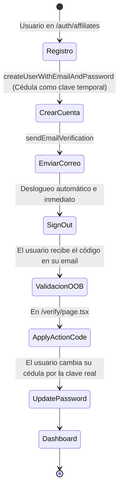

# 01_Auth (Autenticación Vermilion)

> **Nota:** Este archivo es generado y mantenido automáticamente por el Agente de Desarrollo.

Este documento describe el flujo de autenticación parcheado y optimizado de Vermilion.

## Flujo de Registro de Afiliados

Se corrigió la fricción de usuario donde el modal de contraseña se abría prematuramente. Ahora el usuario es forzado a confirmar su identidad vía correo.

**Conexiones en Obsidian:**
- Para ver la relación con los afiliados, revisa [[04_Affiliates]]
- Para entender el panel de administración asociado, revisa [[02_Admin]]
