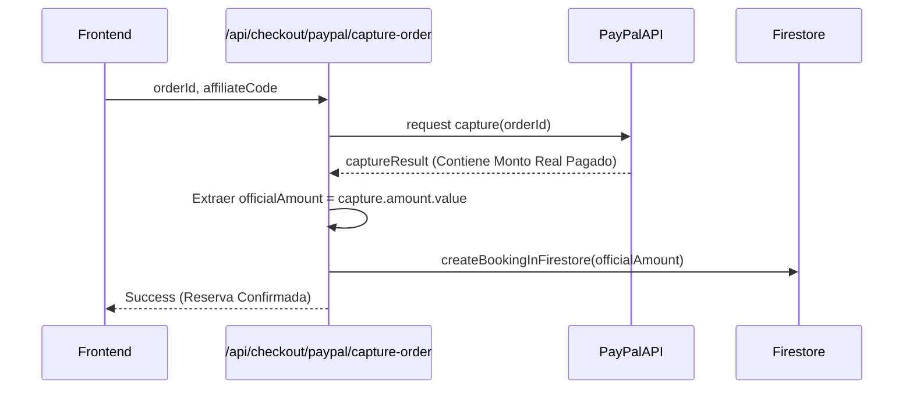

# 05_Ecommerce (Flujos de Pago Vermilion)

> **Nota:** Este archivo es generado y mantenido automáticamente por el Agente de Desarrollo.

## Captura Segura de PayPal

Se identificó y corrigió una vulnerabilidad donde el servidor confiaba en los datos de la interfaz (frontend). Ahora el sistema extrae el `amount` exacto directo del `captureResult` de PayPal.

**Conexiones en Obsidian:**
- Para ver cómo esto afecta las comisiones de los embajadores, revisa [[04_Affiliates]]
